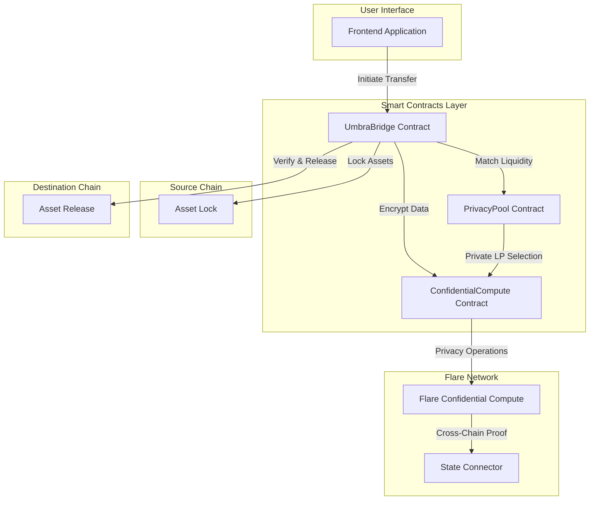
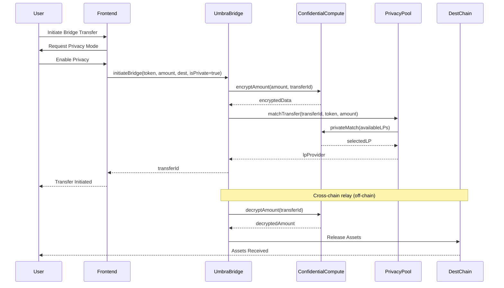
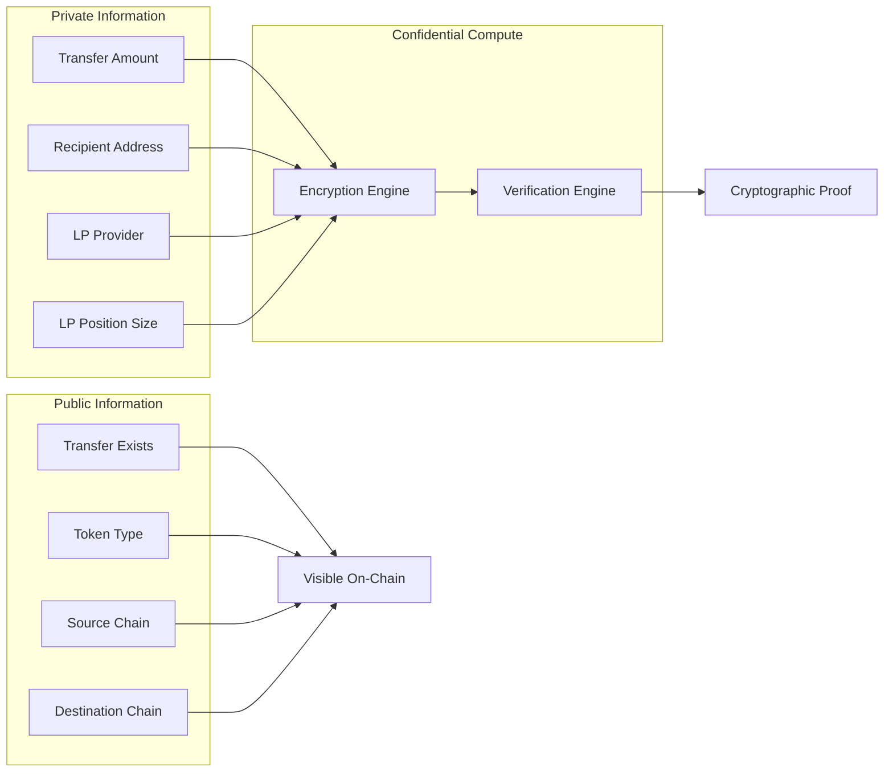

# Umbra Protocol

**The First Private Cross-Chain Bridge**

Umbra Protocol enables privacy-preserving cross-chain asset transfers using Flare's Confidential Compute technology. By encrypting transaction amounts and destinations, Umbra protects users from MEV attacks, front-running, and competitive intelligence leakage while maintaining trustless security.

## Table of Contents

- [Overview](#overview)
- [Architecture](#architecture)
- [Key Features](#key-features)
- [Technical Implementation](#technical-implementation)
- [Smart Contracts](#smart-contracts)
- [Frontend Application](#frontend-application)
- [Getting Started](#getting-started)
- [Deployment](#deployment)
- [Testing](#testing)
- [Security Considerations](#security-considerations)
- [Roadmap](#roadmap)
- [Contributing](#contributing)
- [License](#license)

## Overview

### The Problem

Current cross-chain bridges expose all transaction details publicly, creating several critical issues:

- **MEV Exploitation**: Bots extract $600M+ annually through front-running and sandwich attacks
- **Privacy Loss**: Whale movements and institutional transfers are visible to all
- **Competitive Disadvantage**: Trading strategies and portfolio movements are exposed
- **Regulatory Concerns**: Institutions cannot comply with privacy requirements

### The Solution

Umbra Protocol introduces privacy-preserving bridge technology that:

- Encrypts transaction amounts during transit
- Obscures destination addresses until settlement
- Enables private liquidity provision
- Maintains verifiable security through cryptographic proofs

This is made possible through Flare's Confidential Compute, a feature unavailable on Ethereum, Solana, or other major layer-1 blockchains without complex zero-knowledge circuit implementations.

## Architecture

### System Overview



### Transaction Flow



### Privacy Layer



## Key Features

### Privacy-Preserving Transfers

- **Encrypted Amounts**: Transaction values are encrypted during transit using Flare's Confidential Compute
- **Hidden Destinations**: Recipient addresses remain private until settlement
- **MEV Protection**: Encrypted data prevents front-running and sandwich attacks
- **Verifiable Security**: Cryptographic proofs ensure correctness without revealing private data

### Commitment-Based Private Claims (Tornado-style)

- **Recipient Commitment**: Senders commit to `keccak256(secret, recipient)` instead of
  revealing a recipient on-chain — the destination is hidden until claim time
- **Permissionless Claims**: Anyone holding the secret can `claimTransfer` from any wallet;
  the owner cannot front-run or censor the claim
- **Claim Links**: The dApp generates a portable claim link (transferId + secret) to share
  with the recipient
- **Trustless Finality (roadmap)**: source-chain deposits are proven via the Flare Data
  Connector / State Connector instead of a trusted relayer — see
  [FDC integration design](contracts/docs/FDC-INTEGRATION.md)

### Automated Relayer Bot

- **Live `relayer/` bot** (Node + viem) watches `BridgeInitiated` events on Coston2 and
  Coston, auto-completes public transfers in seconds
- Skips commitment transfers (waiting for the rightful claimer) and private transfers
  (manual proof)
- Cursor persistence (`.cursors.json`) so restarts resume exactly where they left off

### Live Bridge Activity Feed

- The bridge page streams the latest transfers from both testnets with a live indicator
- Each entry links to the explorer; private transfers show an encrypted-amount badge

### Private Liquidity Pools

- **Hidden Positions**: Liquidity providers can obscure their position sizes
- **Private Matching**: LP selection occurs within the Confidential Compute environment
- **Fee Privacy**: Earnings accumulation is not publicly visible
- **Competitive Advantage**: Prevents copycat strategies from competitors

### Cross-Chain Interoperability

- **Multi-Chain Support**: Bridge assets between Flare, Songbird, and external chains
- **Token Agnostic**: Support for any ERC-20 token
- **Trustless Verification**: No centralized intermediaries required
- **Atomic Settlement**: Transactions complete or revert entirely

### Institutional-Grade Features

- **Compliance Ready**: Privacy with optional identity verification layer
- **High-Value Transfers**: Suitable for large institutional movements
- **Audit Trail**: Verifiable transaction history for compliance
- **Professional Security**: OpenZeppelin-audited patterns and comprehensive testing

## Technical Implementation

### Smart Contracts

Built with Solidity 0.8.20 and the Foundry development framework.

#### UmbraBridge.sol

The core bridge contract managing cross-chain transfers.

**Key Functions**:

```solidity
function initiateBridge(
    address token,
    uint256 amount,
    uint256 destChainId,
    address recipient,
    bool isPrivate
) external payable returns (bytes32 transferId)
```

Initiates a cross-chain transfer with optional privacy mode.

```solidity
function completeTransfer(
    bytes32 transferId,
    bytes memory proof
) external onlyOwner
```

Completes a transfer on the destination chain with cryptographic proof.

**State Variables**:

- Transfer registry mapping (`bytes32 => Transfer`)
- Supported tokens and chains
- Fee configuration
- Privacy pool reference
- Confidential compute module reference

**Security Features**:

- ReentrancyGuard protection
- Pausable emergency stop
- Access control (Ownable)
- SafeERC20 token handling
- Input validation on all parameters

#### PrivacyPool.sol

Manages liquidity provision with privacy features.

**Key Functions**:

```solidity
function addLiquidity(
    address token,
    uint256 amount,
    bool isPrivate
) external returns (uint256 shares)
```

Adds liquidity to the pool with optional privacy flag.

```solidity
function matchTransfer(
    bytes32 transferId,
    address token,
    uint256 amount
) external onlyBridge returns (address lpProvider)
```

Privately matches a transfer with available liquidity.

**LP Share Calculation**:

```
shares = (depositAmount × totalShares) / totalLiquidity
```

For the first deposit: `shares = depositAmount`

**Fee Distribution**:

```
lpFees = (bridgeFees × lpFeeShare) / 10000
```

Where `lpFeeShare` defaults to 500 (5%)

#### ConfidentialCompute.sol

Wrapper for Flare's Confidential Compute privacy operations.

**Implementation Note**:

The current implementation uses simplified encryption for demonstration purposes. Production deployment will integrate with Flare's native Confidential Compute module.

**Key Functions**:

```solidity
function encryptAmount(
    uint256 amount,
    bytes32 transferId
) external onlyAuthorized returns (bytes memory encrypted)
```

Encrypts sensitive data using the privacy layer.

```solidity
function decryptAmount(
    bytes32 transferId
) external onlyAuthorized returns (uint256 amount)
```

Decrypts data for authorized operations.

**Production Integration Path**:

1. Replace mock encryption with Flare CC precompile calls
2. Utilize Trusted Execution Environment (TEE)
3. Implement zkSNARK proof generation and verification
4. Connect to Flare State Connector for cross-chain privacy

### Contract Deployment Addresses

All contracts are deployed and verified on **Coston2 testnet** (Chain ID: 114).

| Contract | Address | Status |
|----------|---------|--------|
| **UmbraBridge** | [`0x3aa78d46c03be6a0e58ff0d3e83a6d8ff0a56903`](https://coston2-explorer.flare.network/address/0x3aa78d46c03be6a0e58ff0d3e83a6d8ff0a56903) | ✅ Deployed |
| **PrivacyPool** | [`0xaA5685419dBd36d93dD4627da89B8f94c39399C4`](https://coston2-explorer.flare.network/address/0xaA5685419dBd36d93dD4627da89B8f94c39399C4) | ✅ Verified |
| **ConfidentialCompute** | [`0x391926D40EF9d7e94f5656c4d0A8698714ff20Af`](https://coston2-explorer.flare.network/address/0x391926D40EF9d7e94f5656c4d0A8698714ff20Af) | ✅ Verified |
| **MockUSDC** | [`0xe377Cb5aAB782315eF5bDa4ABA1be953a7156925`](https://coston2-explorer.flare.network/address/0xe377Cb5aAB782315eF5bDa4ABA1be953a7156925) | ✅ Verified |
| **MockConfidentialCompute** | [`0xd8b4875b61130D651409d26C47D49f57BEbC1780`](https://coston2-explorer.flare.network/address/0xd8b4875b61130D651409d26C47D49f57BEbC1780) | ✅ Verified |

Supported bridge tokens on Coston2: **MockUSDC**, **USDT0** (`0xC1A5B41512496B80903D1f32d6dEa3a73212E71F`), **FXRP** (`0x0b6A3645c240605887a5532109323A3E12273dc7`). USDT0 and FXRP are claimed from the official Flare faucet.

The same contracts are deployed on **Coston testnet** (Chain ID: 16): UmbraBridge `0x696dcc6e2b95d57f954d9fe78ebf0e8b75ecea65`, PrivacyPool `0xaA5685419dBd36d93dD4627da89B8f94c39399C4`, ConfidentialCompute `0x391926D40EF9d7e94f5656c4d0A8698714ff20Af`, MockUSDC `0xe377Cb5aAB782315eF5bDa4ABA1be953a7156925`. A live USDT0 transfer was executed Coston2 → Coston (chain 16) and completed with a verified privacy proof.

## Smart Contracts

### Development Setup

```bash
# Navigate to contracts directory
cd contracts

# Install dependencies
forge install

# Build contracts
forge build

# Run tests
forge test

# Run tests with gas reporting
forge test --gas-report

# Run tests with coverage
forge coverage
```

### Test Coverage

```
Test Results: 36/36 passing (100%)

UmbraBridge Tests:
  ✓ testInitiateBridgePublic
  ✓ testInitiateBridgePrivate
  ✓ testCompleteTransfer
  ✓ testCompleteTransferPrivate
  ✓ testCancelTransfer
  ✓ testClaimRefund
  ✓ testInsufficientFee
  ✓ testUnsupportedToken
  ✓ testPausedContract
  ✓ testAccessControl
  ✓ testCalculateFee
  ✓ testGetStats
  ✓ testGetTransfer

PrivacyPool Tests:
  ✓ testAddLiquidity
  ✓ testAddPrivateLiquidity
  ✓ testRemoveLiquidity
  ✓ testMatchTransfer
  ✓ testClaimFees
  ✓ testInsufficientLiquidity
  ✓ testShareCalculation
  ✓ testBelowMinLPAmount
  ✓ testGetAllLPs

ConfidentialCompute Tests:
  ✓ testEncryptAmount
  ✓ testDecryptAmount
  ✓ testEncryptDecryptRoundTrip
  ✓ testPrivateMatch
  ✓ testVerifyExecution
  ✓ testUnauthorizedAccess
  ✓ testPrivacyToggle
  ✓ testGetEncryptedData
  ✓ testGetEncryptionCost
  ✓ testNoLPsReverts
```

### Deployment

```bash
# Set environment variables
export PRIVATE_KEY="your_private_key"
export COSTON2_RPC_URL="https://coston2-api.flare.network/ext/bc/C/rpc"

# Deploy to Coston2
forge script scripts/DeployUmbra.s.sol \
  --rpc-url $COSTON2_RPC_URL \
  --broadcast \
  --verify

# Save deployment addresses
# Update frontend/lib/contracts/addresses.ts with deployed addresses
```

## Frontend Application

### Technology Stack

- **Framework**: Next.js 15 (App Router)
- **Language**: TypeScript
- **Styling**: Tailwind CSS
- **Web3**: wagmi 2.x, viem 2.x
- **State Management**: Zustand
- **Animations**: Framer Motion
- **UI Components**: Radix UI primitives
- **Charts**: Recharts

### Project Structure

```
frontend/
├── app/
│   ├── page.tsx                    # Landing page
│   ├── bridge/page.tsx             # Bridge interface
│   ├── liquidity/page.tsx          # LP management
│   └── dashboard/page.tsx          # Analytics
├── components/
│   ├── bridge/
│   │   ├── BridgeForm.tsx          # Main bridge UI
│   │   ├── PrivacyToggle.tsx       # Privacy mode switch
│   │   ├── ChainSelector.tsx       # Chain selection
│   │   ├── AmountInput.tsx         # Token amount input
│   │   └── TransactionStatus.tsx   # Status tracking
│   ├── liquidity/
│   │   ├── AddLiquidityForm.tsx
│   │   ├── RemoveLiquidityForm.tsx
│   │   └── LPPositionCard.tsx
│   └── wallet/
│       └── ConnectWallet.tsx       # Wallet connection
├── hooks/
│   ├── useUmbraBridge.ts           # Bridge interactions
│   ├── usePrivacyPool.ts           # Pool interactions
│   └── useWallet.ts                # Wallet management
└── lib/
    ├── contracts/                   # ABIs and addresses
    └── web3/                        # Web3 configuration
```

### Development Setup

```bash
# Navigate to frontend directory
cd frontend

# Install dependencies
npm install

# Set environment variables
cp .env.example .env.local
# Edit .env.local with your configuration

# Run development server
npm run dev

# Open http://localhost:3000
```

### Environment Variables

```bash
# .env.local
NEXT_PUBLIC_WALLETCONNECT_PROJECT_ID=your_project_id
NEXT_PUBLIC_ENABLE_TESTNETS=true
```

### Building for Production

```bash
# Build the application
npm run build

# Start production server
npm start

# Or deploy to Vercel
vercel --prod
```

### Key Components

#### Privacy Toggle

The privacy toggle is the flagship UI component that demonstrates Umbra's core value proposition.

**Features**:
- Visual distinction between public and private modes
- Educational tooltips explaining privacy benefits
- Animated state transitions
- Clear indication of Flare Confidential Compute usage

**Implementation**:
```typescript
<PrivacyToggle 
  enabled={privacyEnabled} 
  onChange={setPrivacyEnabled} 
/>
```

When enabled:
- Purple accent color indicates active privacy
- Lock icon visualization
- "MEV protection active" status message
- Clear explanation of data encryption

#### Bridge Form

Complete bridge interface with:
- Chain selection (source and destination)
- Token and amount input
- Recipient address field
- Privacy mode toggle
- Transaction fee display
- Real-time status updates

## Getting Started

### Prerequisites

- Node.js 18+ and npm
- Foundry (for smart contract development)
- Git
- MetaMask or compatible Web3 wallet

### Quick Start

1. **Clone the repository**
```bash
git clone https://github.com/yourusername/umbra-protocol.git
cd umbra-protocol
```

2. **Install contract dependencies**
```bash
cd contracts
forge install
```

3. **Install frontend dependencies**
```bash
cd ../frontend
npm install
```

4. **Run tests**
```bash
cd ../contracts
forge test
```

5. **Start development server**
```bash
cd ../frontend
npm run dev
```

6. **Access the application**
```
http://localhost:3000
```

### Testing on Coston2

1. **Get testnet tokens**
   - Add Coston2 network to MetaMask
   - Visit Flare faucet to get test FLR
   - Mint test USDC from deployed MockToken contract

2. **Connect wallet**
   - Open application
   - Click "Connect Wallet"
   - Select Coston2 network

3. **Bridge assets**
   - Select source and destination chains
   - Enter amount and recipient
   - Toggle privacy mode
   - Confirm transaction

## Deployment

### Smart Contract Deployment

```bash
cd contracts

# Configure deployment
export PRIVATE_KEY="your_deployer_private_key"
export COSTON2_RPC_URL="https://coston2-api.flare.network/ext/bc/C/rpc"

# Run deployment script
forge script scripts/DeployUmbra.s.sol \
  --rpc-url $COSTON2_RPC_URL \
  --broadcast \
  --verify \
  -vvvv

# Save deployment addresses
```

### Frontend Deployment

#### Vercel (Recommended)

```bash
cd frontend

# Install Vercel CLI
npm i -g vercel

# Deploy
vercel --prod
```

#### Manual Deployment

```bash
cd frontend

# Build application
npm run build

# Output will be in .next/ directory
# Deploy to your hosting provider
```

### Post-Deployment Configuration

1. **Update contract addresses**
   - Edit `frontend/lib/contracts/addresses.ts`
   - Add deployed contract addresses for each network

2. **Verify contracts**
   - Verify on Flare block explorer
   - Publish source code for transparency

3. **Test live deployment**
   - Complete end-to-end bridge transaction
   - Verify privacy mode functionality
   - Test LP operations

## Testing

### Smart Contract Tests

```bash
cd contracts

# Run all tests
forge test

# Run specific test file
forge test --match-path test/UmbraBridge.t.sol

# Run with verbose output
forge test -vvv

# Generate gas report
forge test --gas-report

# Generate coverage report
forge coverage
```

### Frontend Tests

```bash
cd frontend

# Type checking
npm run typecheck

# Linting
npm run lint

# Build test
npm run build
```

### Integration Testing

End-to-end testing checklist:

- [ ] Wallet connection (MetaMask, WalletConnect)
- [ ] Token approval flow
- [ ] Public bridge transaction
- [ ] Private bridge transaction
- [ ] Add liquidity
- [ ] Remove liquidity
- [ ] View transaction history
- [ ] Mobile responsiveness
- [ ] Error handling

## Security Considerations

### Smart Contract Security

**Implemented Measures**:

- **ReentrancyGuard**: Protection against reentrancy attacks on all state-changing functions
- **SafeERC20**: Safe token transfer operations preventing common ERC-20 pitfalls
- **Pausable**: Emergency stop mechanism for critical issues
- **Access Control**: Owner-based permissions for administrative functions
- **Input Validation**: Comprehensive checks on all user inputs
- **Checks-Effects-Interactions**: Pattern followed throughout

**Audit Status**:

Current implementation uses OpenZeppelin's audited libraries. Full independent audit recommended before mainnet deployment.

**Known Limitations**:

1. **Mock Confidential Compute**: Current implementation uses simplified encryption for demonstration. Production requires integration with actual Flare Confidential Compute module.

2. **Centralized Ownership**: Single owner controls admin functions. Production should use multi-signature wallet.

3. **Cross-Chain Verification**: Simplified for hackathon. Production requires robust cross-chain message verification.

### Frontend Security

- No private keys stored in browser
- Transaction signing handled by wallet
- Input sanitization on all forms
- HTTPS required in production
- Content Security Policy headers recommended

### Best Practices for Users

- Verify contract addresses before interaction
- Start with small test amounts
- Review transaction details before signing
- Keep wallet software updated
- Use hardware wallets for large amounts

## Roadmap

### Phase 1: Foundation (Current)

- [x] Core smart contract development
- [x] Privacy layer integration (demo)
- [x] Frontend interface
- [x] Coston2 testnet deployment
- [x] Coston testnet deployment (identical addresses)
- [x] Real faucet tokens (USDT0, FXRP) registered
- [x] Commitment-based private claims (initiateBridgePrivate / claimTransfer)
- [x] Live relayer bot (auto-completes public transfers)
- [x] Live activity feed + claim page in dApp
- [x] Comprehensive testing (36 contract tests, via_ir + optimizer)
- [x] Security documentation

### Phase 2: Production Ready (Month 1-2)

- [ ] Flare Data Connector / State Connector integration for trustless finality
      (design in `contracts/docs/FDC-INTEGRATION.md`)
- [ ] Full Flare Confidential Compute integration (real TEE/MPC attestation)
- [ ] Security audit by reputable firm
- [ ] Multi-signature ownership implementation
- [ ] Advanced privacy features (destination encryption)
- [ ] Mainnet deployment on Flare
- [ ] Support for major tokens (WFLR, USDC, USDT)

### Phase 3: Expansion (Month 3-4)

- [ ] Additional chain integrations (Ethereum, BSC, Arbitrum)
- [ ] FAssets bridge compatibility
- [ ] Enhanced LP features (concentrated liquidity)
- [ ] Governance token launch
- [ ] DAO formation
- [ ] Mobile application

### Phase 4: Enterprise (Month 5-6)

- [ ] Institutional features (KYC/AML compliance layer)
- [ ] API for programmatic access
- [ ] OTC desk for large private transfers
- [ ] Strategic partnerships
- [ ] Market maker integration
- [ ] Cross-chain liquidity aggregation

### Long-Term Vision

Umbra Protocol aims to become the default privacy infrastructure for all cross-chain asset transfers on Flare. By combining trustless security with institutional-grade privacy, we enable:

- **Institutional Adoption**: Banks and funds can use DeFi with compliance
- **MEV Protection**: Retail users protected from predatory trading
- **Competitive Privacy**: Protocols can execute strategies without exposure
- **Regulatory Compliance**: Privacy with optional transparency for authorities

## Contributing

We welcome contributions from the community. Please follow these guidelines:

### Development Process

1. Fork the repository
2. Create a feature branch (`git checkout -b feature/amazing-feature`)
3. Make your changes
4. Write or update tests
5. Ensure all tests pass
6. Commit your changes (`git commit -m 'Add amazing feature'`)
7. Push to the branch (`git push origin feature/amazing-feature`)
8. Open a Pull Request

### Code Standards

**Smart Contracts**:
- Follow Solidity style guide
- Add NatSpec comments
- Include tests for new functionality
- Gas optimization where reasonable

**Frontend**:
- TypeScript strict mode
- Follow existing component patterns
- Responsive design required
- Accessibility considerations

### Reporting Issues

Use GitHub Issues to report bugs or suggest features. Include:
- Clear description
- Steps to reproduce (for bugs)
- Expected vs actual behavior
- Environment details (network, browser, etc.)

## License

This project is licensed under the MIT License. See [LICENSE](LICENSE) file for details.

## Acknowledgments

- **Flare Network**: For Confidential Compute technology and cross-chain infrastructure
- **OpenZeppelin**: For audited smart contract libraries
- **Foundry**: For excellent development tooling
- **Next.js Team**: For the robust React framework

## Contact and Support

- **Documentation**: [docs.umbraprotocol.com](https://docs.umbraprotocol.com) (coming soon)
- **Website**: [umbraprotocol.com](https://umbraprotocol.com) (coming soon)
- **Twitter**: [@UmbraProtocol](https://twitter.com/UmbraProtocol) (coming soon)
- **Discord**: [discord.gg/umbra](https://discord.gg/umbra) (coming soon)
- **Email**: dev@umbraprotocol.com

## Hackathon Information

**Built for**: Flare Summer Signal 2026

**Submission Tracks**:
- Bounty 1: Interoperable Asset Products
- Bounty 2: Confidential Compute Apps

**Team**: [Your team name/members]

**Submission Date**: August 2026

---

**Umbra Protocol** - Privacy-preserving cross-chain bridges for the institutional age of DeFi.
