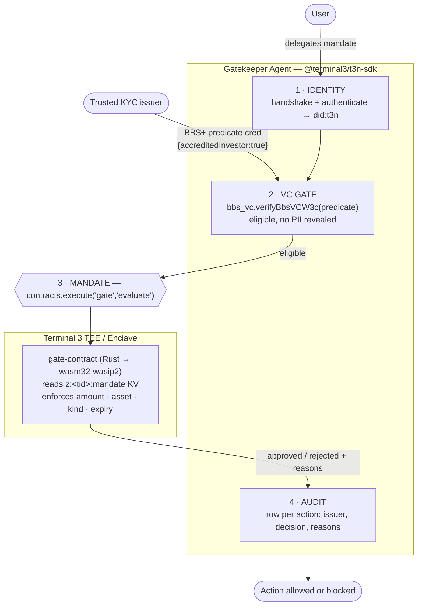

# Gatekeeper Agent — Terminal 3 Agent Dev Kit Bounty (Launch Ed)

[](https://github.com/PugarHuda/t3-gatekeeper-agent/actions/workflows/ci.yml)

**▶ [Demo video (2½ min)](https://gatekeeper-evidence.vercel.app)** — identity → BBS+ VC gate → revocation → hardware mandate → audit → signed in-TEE dispatch, plus true selective disclosure and a stateful velocity limit.

## The problem, concretely

**Meridian Private Credit Fund** sells a $250k-minimum note. Securities law lets
it sell only to *accredited* investors — so today every buyer uploads a passport,
bank statements and a net-worth attestation, and Meridian stores all of it. That
is a compliance cost on the way in and a breach liability forever after: they
become custodians of a data set they never wanted, purely to answer one yes/no
question.

Now the investor delegates buying to an AI agent, and two things break at once.
The agent needs the investor's account credentials, so a prompt injection spends
real money. And the limits — $5,000 a trade, USDC only, this fund only — live in
the agent's own prompt or code, which is exactly the thing that cannot be trusted
to enforce them.

**Gatekeeper answers both.** Meridian learns exactly one fact — *this buyer is
accredited* — proven by a BBS+ zero-knowledge proof, never the net worth behind
it. The mandate lives in the enclave's key-value store, so the agent cannot widen
its own ceiling: the decision and the outbound order are the **same enclave
call**, and a rejected action never reaches the network.

**Who it is for:** tokenised RWA and private-credit distribution platforms, and
the treasury or wealth agents that transact with them.

The general principle: an agent should *prove* it is allowed to act without ever
holding the data that proves it, and its limits should be enforced by hardware,
not by its own code.




```
┌─ Gatekeeper Agent (TypeScript / @terminal3/t3n-sdk) ───────────────────────┐
│ 1. IDENTITY   handshake() + authenticate()            → did:t3n            │
│ 2. VC GATE    bbs_vc.verifyBbsVCW3c(predicateCred)    → eligible, no PII   │
│ 3. MANDATE    contracts.execute("gate", "evaluate")   → TEE decision       │
│ 4. AUDIT      structured row (issuer, decision, reasons)                   │
└────────────────────────────────────────────────────────────────────────────┘
        │                                   │
   @terminal3/bbs_vc + vc_core      gate-contract (Rust → wasm32-wasip2)
   (predicate credential)           reads mandate from z:<tid>:mandate KV,
                                    enforces amount / asset / kind /
                                    counterparty / valid-after / expiry
```

## Layout

| Path | What |
| --- | --- |
| `agent/` | The agent runtime (identity + VC gate + contract invoke + audit). `npm run demo`. |
| `qa-console/` | Browser console + Playwright E2E over the contract's **real** Rust decision logic — happy path, wrong paths, API abuse. Runs offline, spends no credits. |
| `video/` | The demo video, rendered programmatically (Remotion + neural TTS + burned-in captions). Scene lengths derive from the measured audio, so narration cannot drift. |
| `site/` | The published evidence page ([gatekeeper-evidence.vercel.app](https://gatekeeper-evidence.vercel.app)). |
| `gate-contract/` | The Rust→WASM TEE mandate contract. Builds to a wasm component, registered to the tenant. |
| `t3-qa/` | Verification sandbox — standalone smoke tests for each layer (auth, BBS+ issue/verify, tamper test, contract deploy + invoke, live TDX attestation parse). |
| `submission/` | Demo script, BUIDL description, [Track B bug reports](submission/TRACK_B_BUG_REPORTS.md) (8 onboarding/SDK/doc issues found while building), [technical deep-dive](submission/TECH_DEEPDIVE.md) (BBS+ pairing + TDX quote layout), [verification log](submission/VERIFICATION.md), and an [adoption roadmap](submission/ADOPTIONS.md) (A2A / ERC-8004 / Web Bot Auth — cheap/high/out-of-box). |
| `agent/agent-card.json` | A2A + ERC-8004 style agent card (identity, skills, trust). |

## Verified end-to-end on T3N testnet

Every layer was run against the live testnet, not mocked:

- **Auth** — `handshake` → `authenticate` → `getUsage` (live balance returned).
- **BBS+ VC** — issue (`bbs-2023` DataIntegrityProof) + verify; a tampered claim
  is correctly rejected (`isValid:false`), so the signature is enforced.
- **True selective disclosure** — issuer signs a full record, holder derives a ZK
  proof revealing only one claim, verifier accepts; forged value / wrong nonce
  rejected (`npm run demo:sd`).
- **TEE contract** — `gate-contract` compiled to a ~213 KB wasm component,
  registered (`contract_id` returned), and `evaluate()` invoked inside the
  Enclave returning approved/rejected decisions with the cluster timestamp and
  tenant DID resolved host-side.
- **Stateful velocity limit** — `gate-contract` `spend()` (v0.6.0, contract_id
  175) tracks a cumulative per-window total in the contract's KV map and rejects
  once the running total would exceed the cap — **enforced across invocations in
  hardware** (`t3-qa/velocity-test.mjs`: 3 spends, the 3rd correctly rejected).

## The enclave is the enforcement point (v0.7.0 — v0.8.0)

`evaluate` and `dispatch_action` are two host calls, so an agent could simply
skip the first — the mandate held only while the agent cooperated. And `evaluate`
accepted an **inline** mandate, so the agent supplied the limits it was judged
against. **`execute_action` closes both holes**: it reads the mandate from the
enclave's KV store (no inline escape hatch), decides, and performs the outbound
call in the *same* invocation — so a rejected action cannot reach the network.
The velocity window is likewise derived from the cluster clock, not from the
caller, who could otherwise reset the running total by renaming the window.

**v0.8.0 adds two more mandate dimensions.** `allowed_issuers`: a BBS+ signature
proves the *issuer* signed the claim, never that the issuer is anyone the fund
trusts — and the agent generates its own issuer key, so without this it could
mint its own "accredited investor" credential. And `counterparty_limits`, a
per-payee ceiling applied *in addition* to the global cap, never instead of it.

> **Deployment state.** v0.8.0 is built and unit-tested but **not registered** —
> the account's testnet credits ran out (see bug #16). The version live on the
> network is v0.7.0, `contract_id 479`.

## Advanced SDK adoptions (shipped)

Beyond the core gate, the agent layer ships two ecosystem integrations the ADK
advertises (see [submission/ADOPTIONS.md](submission/ADOPTIONS.md)):

- **Web Bot Auth (RFC 9421)** — `agent/src/web-bot-auth.mjs` signs the agent's
  outbound action requests with Ed25519 HTTP Message Signatures
  (`tag="web-bot-auth"`) so a destination can verify the request came from this
  agent before acting. The "front door" used by Visa TAP / Mastercard Agent Pay.
  The public key is **published** at
  [`/.well-known/http-message-signatures-directory`](https://gatekeeper-evidence.vercel.app/.well-known/http-message-signatures-directory),
  and a test signs locally, fetches that key over the internet, and verifies —
  nothing shared in advance, which is the whole point of a key directory.
  Signatures are **freshness-bounded** (default 5 minutes, clock-skew tolerant):
  `created` is inside the signature base, so it cannot be back-dated, but it has
  to actually be checked or a captured payment instruction replays forever.
- **A2A capability exchange** — `agent/src/a2a.mjs` lets two agents handshake by
  exchanging a BBS+ capability credential with **selective disclosure**: an agent
  proves one capability without revealing the rest of its manifest.

Plus a **credential-revocation pre-gate** (`agent/src/revocation.mjs`,
`@terminal3/revoke_vc` `isRevoked()`): a revoked credential blocks the action even
if the BBS+ proof still verifies. Config-gated — skipped (fail-open) unless
`REVOCATION_REGISTRY_ADDRESS` + `REVOCATION_RPC_URL` are set.

## Tests — 107, all offline except where noted

| Suite | Count | What it covers |
| --- | --- | --- |
| Rust (`gate-contract`) | 28 | the mandate rules, every dimension, deny-by-default |
| Node (`agent`) | 40 | BBS+, selective disclosure, A2A, revocation, Web Bot Auth + key directory + replay window |
| QA console (`qa-console`) | 13 | Playwright over the **real** Rust `decide()` — happy path, 6 wrong paths, 4 API-abuse cases |
| Live site | 10 | the deployed page, incl. a Web Bot Auth key round trip over the public internet |
| Doc / docx / video | 16 | the submission artifacts actually render, and the video decodes with audio |

```bash
cd gate-contract && cargo test                    # 28
cd agent        && npm test                       # 40
cd qa-console   && node --test e2e.test.mjs       # 13
```

And an **in-TEE action dispatch**: on approval, step [5] not only signs the
request but also executes it **from inside the enclave** via the contract's
`dispatch_action` (host `http` interface) — the path where `http-with-placeholders`
injects credentials so the agent never holds them. **Verified live end-to-end: the
enclave performs the outbound POST and returns HTTP 200.** Egress is authorised by
the *caller*, not the contract: `npm run grant:egress` writes an `agent-auth` grant
(contract + functions + `allowedHosts`) via `tee:user/contracts::agent-auth-update`.
Without it the contract still runs and `http.call` returns a typed
`host/http.egress_denied` — deny-by-default, per destination host.
An ERC-8004 on-chain identity is also one funded transaction away
(`npm run register:erc8004`, real EIP-8004 ABI). See
[submission/ADOPTIONS.md](submission/ADOPTIONS.md).

## Quickstart

```bash
# 1. build the TEE contract  (Windows: see gate-contract/README.md for the gnu toolchain note)
cd gate-contract && cargo build --lib --target wasm32-wasip2 --release && cd ..

# 2. run the agent
cd agent
cp .env.example .env        # paste T3N_API_KEY + DID from the token-claim page
npm install
npm run setup               # register the contract to your tenant
npm run grant:egress        # authorise the enclave to reach ACTION_ENDPOINT's host
npm run demo                # identity -> VC gate -> TEE mandate -> audit -> in-TEE dispatch
```

`ACTION_ENDPOINT` defaults to the illustrative `https://broker.example/v1/orders`.
Point it at an endpoint you control (`ACTION_ENDPOINT=https://…`) and re-run
`grant:egress` to see step [5] actually leave the enclave.

## Security note

The T3N API key grants full sandbox access and is shown only once on the claim
page. Keep it in `agent/.env` (gitignored); never commit or share it.

## Bugs & doc gaps found while building (Track B)

Building this end-to-end surfaced **8 SDK / backend / onboarding / documentation
issues**, written up with repro steps in
[`submission/TRACK_B_BUG_REPORTS.md`](submission/TRACK_B_BUG_REPORTS.md) (paste-ready
form versions in [`TRACK_B_DORAHACKS.md`](submission/TRACK_B_DORAHACKS.md)):

1. `verifyBbsVc` returns literal `undefined` instead of the failure reason (`@terminal3/bbs_vc`, low)
2. `getNodeUrl("testnet")` returns the string `"testnet"`; `getNodeUrl()` returns the PROD url (`@terminal3/t3n-sdk`, medium)
3. "Smart VCs" docs claim ZK selective-disclosure VPs, but the SDK ships no holder-side derive (doc gap, medium)
4. Referenced onboarding repo `Terminal-3/adk-getting-start` is empty (onboarding, low)
5. Building a TEE contract on Windows fails (no native linker) and it's undocumented (doc gap, medium)
6. `tenant.claim()` returns HTTP 500 for an already-provisioned tenant (backend, medium)
7. Importing `vp` / `agent-registry` deploys but 500s on every `execute`; no register-time validation (backend/WIT, high)
8. Newest contract version shadows pinned versions; no get-contract-id API; private-map ACL re-register footgun (backend, high)

## Author / links

Pugar Huda Mantoro —
[LinkedIn](https://www.linkedin.com/in/pugar-huda-mantoro/) ·
[X/Twitter](https://x.com/BangDropID) ·
[GitHub](https://github.com/PugarHuda) ·
[Demo video](https://gatekeeper-evidence.vercel.app)
