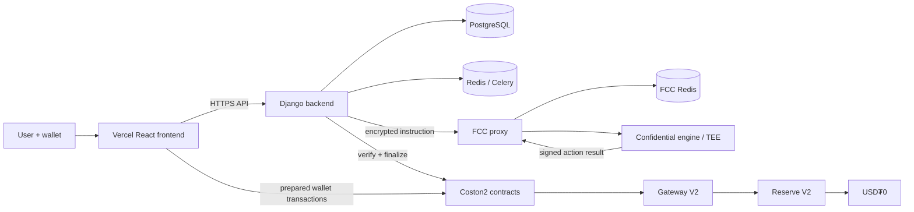

# Balary

Confidential payroll and confidential salary credits on Flare, combining encrypted payroll state, wallet-authorized transactions, and lifecycle-safe confidential compute.

> Flare Summer Signal — Bounty 2: Confidential Compute Apps. Current deployment: Coston2 testnet.

## The Problem

Payroll is commercially and personally sensitive. A naïve on-chain payroll system can expose employee compensation, aggregate payroll size, treasury timing, and financial relationships. That information should not become public simply because settlement uses a public ledger.

## The Solution

Balary keeps employee inputs and the private credit ledger encrypted while retaining verifiable Coston2 settlement. The React frontend collects explicit wallet approvals; the Django backend validates workflow state and prepares exact transaction payloads; Flare Confidential Compute processes encrypted instructions in a TEE; and V2 gateway and reserve contracts enforce authorized confidential-credit transitions and USD₮0 settlement.

The design does not assume a TEE process identity lives forever. Lifecycle controls detect identity drift, pause affected operations, validate a replacement, rotate the signer epoch, verify ledger continuity, and resume only after recovery checks pass.

## Why Flare

Balary uses Flare Coston2 for contract execution and USD₮0 settlement, plus Flare Confidential Compute's extension, machine-registration, proxy, and signed-action model. The contracts bind results to the selected TEE, extension, signer, and signer epoch before accepting confidential state transitions.

## Key Features

- Wallet authentication and institution roles
- Encrypted employee records and payroll inputs
- Backend-prepared `to`, `data`, and `value` transaction boundary
- Confidential payroll computation and private credit ledger
- Explicit USD₮0 reserve approval and deposit
- Relayer-assisted confidential withdrawal operations
- TEE identity and signer-epoch validation
- Automated lifecycle recovery and fail-closed health states
- Coston2 transaction tracking, notifications, scheduling, and audit events

## Architecture



The wallet signs user-authorized operations. The backend and relayer handle only the server-side operations assigned to them; browser code does not reconstruct security-sensitive calldata where a prepared-transaction endpoint exists.

## Confidentiality Model

Encrypted employee fields, payroll rows, salary calculations, private credit balances, and withdrawal authorization data remain off the public ledger. Public Coston2 state includes contract addresses, transaction senders, transaction timing, commitments/roots, status transitions, and ordinary ERC-20 settlement transfers. Balary does not claim that public blockchain transactions or USD₮0 transfers are invisible.

See [Confidential Compute](docs/confidential-compute.md) and [Security](docs/security.md).

## TEE Lifecycle Recovery

TEE machine identity may change when its machine process is recreated. V2 treats that as an operational event rather than silently trusting a new identity:

1. detect drift between observed and registered identity;
2. pause the affected lane;
3. validate and register the replacement TEE;
4. retire the stale identity;
5. rotate the signer and signer epoch immediately;
6. verify encrypted snapshot/root continuity and zero-state safety;
7. resume only after readiness checks succeed.

Details are in [Lifecycle Recovery](docs/lifecycle-recovery.md).

## Repository Structure

| Directory | Purpose |
| --- | --- |
| `frontend/` | Vite, React, TypeScript, wallet UI, and frontend tests |
| `backend/` | Django API, Celery jobs, lifecycle controller, migrations, and tests |
| `smart-contracts/` | Hardhat contracts, V2 deployment/recovery scripts, and tests |
| `confidential-engine/` | Go TEE application, encrypted ledger/store, and state-audit tool |
| `deploy/` | Sanitized Compose, Caddy, Docker build, and health-check definitions |
| `docs/` | Architecture, API, security, lifecycle, deployment, and demo guides |
| `scripts/` | Repository-wide validation helpers |

Internal `Zalary` contract names, Django settings, migration references, service URLs, and persistent volume names intentionally remain where renaming could break deployed compatibility.

## Live Deployment

| Item | Current Coston2 value |
| --- | --- |
| Chain ID | `114` |
| Confidential Credits extension | `66132` |
| Gateway V2 | `0x554f98C9494A46a9Dd0293049abe30eeDb89bA1B` |
| Reserve V2 | `0x409Ac7a3d2251Ba06babfBBe105dd0a84b381C41` |
| USD₮0 | `0xC1A5B41512496B80903D1f32d6dEa3a73212E71F` |
| Active V2 TEE | `0x32575A98a84638FFa3e884F9D0439924D668dEb6` |
| API | `https://zalary-api.104.237.9.230.sslip.io` |
| FCC | `https://zalary-fcc.104.237.9.230.sslip.io` |

The historical `zalary-*` service domains remain accurate until Balary-branded domains are configured. No public frontend URL is claimed before Vercel deployment.

## Quick Start

```bash
# Frontend
cd frontend && cp .env.example .env.local && npm ci && npm run dev

# Backend (new terminal)
cd backend && python -m venv .venv
# activate .venv, then:
pip install -r requirements.txt
cp .env.example .env
python manage.py migrate && python manage.py runserver

# Contracts
cd smart-contracts && npm ci && npm run compile

# Confidential engine
cd confidential-engine && go test ./...
```

Example environment files contain placeholders only. Never use production keys in the repository.

## Testing

```bash
cd frontend && npm ci && npm run typecheck && npm run verify:integration && npm test && npm run build
cd backend && python manage.py check && python manage.py test
cd smart-contracts && npm ci && npm run typecheck && npm run compile && npm test
cd confidential-engine && go test ./... && go vet ./...
```

Confirmed frontend baseline: TypeScript and integration verification pass; 15 test files and 35 tests pass; the Vite production build passes. Component validation results from the reorganized paths are recorded in the final handoff.

## Security

- Repository examples contain no operational secrets.
- Every `VITE_*` value is public browser configuration.
- Deployer, relayer, proxy, state-encryption, Django, database, and provider credentials stay server-side.
- Prepared-transaction responses preserve the backend/browser authorization boundary.
- TEE action signatures and signer epochs are verified before confidential results are accepted.
- Encrypted state integrity and root continuity are checked during lifecycle recovery.

Review [Security](docs/security.md) before local deployment.

## Demo

1. Connect a wallet and switch to Coston2.
2. Register or select an institution workspace.
3. Add encrypted employee data and prepare a payroll.
4. Sign the exact backend-prepared transaction.
5. Observe confidential processing through FCC and the TEE.
6. Approve and deposit the exact USD₮0 reserve amount.
7. Review public transaction confirmation without exposing the private credit ledger.
8. Open lifecycle readiness to demonstrate identity and signer health.

See [Demo Guide](docs/demo-guide.md) for judge-facing checkpoints.

## Technical Highlights

- Clean confidential-credit V2 gateway/reserve migration
- Signed TEE-result verification bound to machine identity and signer epoch
- Encrypted ledger snapshots with integrity checks
- Lifecycle controller for identity drift and controlled recovery
- Explicit zero-state and ledger-root continuity checks
- Backend-prepared transaction boundary with wallet/chain enforcement
- Reproducible Coston2 deployment definitions with separated secret files

## Current Status

Balary is running on Flare Coston2 testnet. The backend, FCC endpoint, confidential-credit V2 contracts, reserve, and current TEE integration have public deployment identifiers above. This is not a Flare mainnet deployment.

## Roadmap

- Deploy the Balary-branded frontend on Vercel and configure its allowed API origin.
- Complete a recorded judge demo including lifecycle readiness evidence.
- Replace historical service domains after DNS and certificate cutover.
