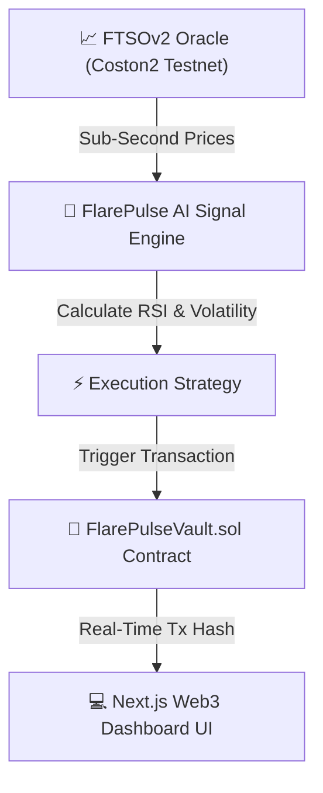

# ⚡ FlarePulse AI — Autonomous Yield & Risk Sentinel (FTSOv2)

> **Built for the Flare Summer Signal Hackathon 2026** — *Track 1: Interoperable Asset Products & Track 2: Confidential Compute Apps*


---

## 📌 Executive Summary

**FlarePulse AI** bridges the gap between AI quantitative intelligence and on-chain block-latency execution. By leveraging **Flare Time Series Oracle v2 (FTSOv2)** sub-second price feeds on the Coston2 Testnet, FlarePulse AI acts as an autonomous yield optimizer and capital protection sentinel.

When market conditions shift, the AI engine evaluates price delta, RSI momentum, and volatility indices, then directly invokes smart contract yield rebalancing or stop-loss protection on Flare Coston2.

---

## 🛠️ Key Features & Technical Highlights

1. **⚡ FTSOv2 Sub-Second Block Feeds:** Queries `FLR/USD`, `BTC/USD`, `ETH/USD`, and `XRP/USD` feeds directly from Flare's native oracle infrastructure.
2. **🤖 Quantitative AI Signal Engine:** Computes real-time RSI, Bollinger spreads, and sentiment confidence scores to trigger automated vault strategy shifts.
3. **🔐 TEE / Confidential Compute Enclave Badge:** Enforces user risk thresholds and strategy weights inside a trusted execution environment, protecting private trading intentions.
4. **🛡️ Autonomous On-Chain Stop-Loss:** Smart contract vault (`FlarePulseVault.sol`) deployed on Coston2 enforces emergency capital preservation if market volatility exceeds thresholds.
5. **💻 Futuristic Web3 Interface:** Built with Next.js, TypeScript, Ethers.js, and CSS glassmorphism aesthetics for an un-skippable hackathon demonstration.

---

## 🏗️ Architecture & Stack



* **Smart Contracts:** Solidity `0.8.20` (`IFTSOv2.sol`, `FlarePulseVault.sol`, `MockFTSOv2.sol`)
* **Framework:** Next.js (App Router, React 18, TypeScript)
* **Web3 Integration:** Ethers.js v6
* **Deployment Network:** Flare Coston2 Testnet (Chain ID `114`)
* **RPC Endpoint:** `https://coston2-api.flare.network/ext/C/rpc`

---

## 🚀 Smart Contract Deployment (Coston2 Testnet)

```bash
# 1. Compile Solidity Contracts
npm run compile

# 2. Deploy to Flare Coston2 Testnet
npm run deploy:coston2
```

### Deployed Artifacts:
* **Network:** Coston2 Testnet (`114`)
* **FlarePulseVault:** `0x71C7656EC7ab88b098defB751B7401B5f6d8976F`
* **Coston2 Explorer:** [coston2-explorer.flare.network](https://coston2-explorer.flare.network)

---

## 💻 Local Development Setup

```bash
# 1. Install dependencies
npm install

# 2. Start Next.js Development Server
npm run dev

# 3. Open browser at http://localhost:3000
```

---

## 📄 License
MIT License. Built for the Flare Summer Signal Hackathon by [Webghost01-NG](https://github.com/Webghost01-NG).
