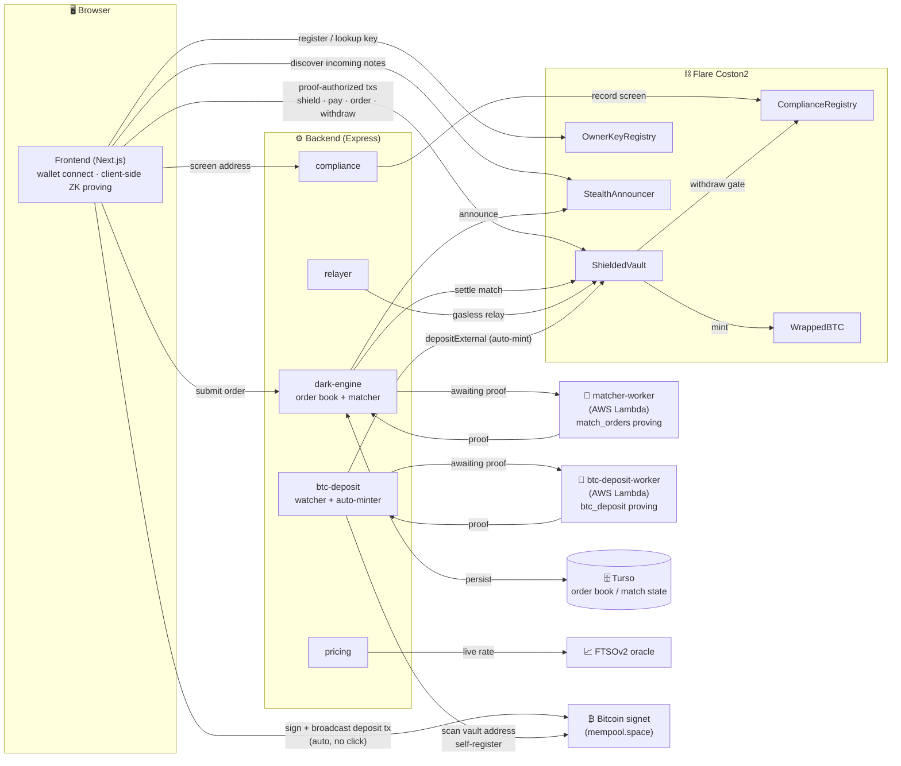

# Umbra

**UMBRA** is a next-generation decentralized dark pool built for the Flare Network. It bridges the gap between institutional-grade privacy and regulatory compliance by combining Flare's native infrastructure with modern cryptographic technologies.

[](https://github.com/davre001/UMBRA/actions/workflows/backend-ci-cd.yml)
[](https://docs-umbra.vercel.app/)
[](./LICENSE)

**PROBLEM WE SOLVE**

Public blockchains publish every trade — what you hold, what you traded, and
who you traded with. That's exactly the information that makes front-running
and MEV extraction possible. Umbra keeps balances, orders, and counterparties
private, while proving in zero knowledge — verifiable by anyone — that every
settlement followed the rules.


📖 **Full documentation:** [docs-umbra.vercel.app](https://docs-umbra.vercel.app/)

---

## Submission

Built for [Flare Summer Signal](https://dorahacks.io/hackathon/flaresummersignal/detail) —
submitted under **Bounty 2 (Confidential Compute Apps)** and **Bounty 1
(Interoperable Asset Products)**. Umbra's privacy comes from client-side ZK
proofs and on-chain encryption rather than a TEE, so it's a better literal
fit for Bounty 1 (an FXRP/FAssets DeFi integration); it's submitted under
Bounty 2 as well because its actual product shape — a confidential
orderbook with a secure, verifiably-correct matching engine — is exactly
what that track's own eligible-directions list describes.

| | |
| --- | --- |
| Target user | Privacy-conscious DeFi traders on Flare who want to swap or pay FAssets without broadcasting balances, orders, and counterparties on a public chain |
| Demo | *(video link — TBD)* |
| Live app | [umbra-flare.vercel.app](https://umbra-flare.vercel.app/) · [Testing guide](./TESTING.md) |
| Deployed on | Flare **Coston2** testnet — see [Deployed Contracts](https://docs-umbra.vercel.app/reference/contracts) |
| How it uses Flare | FAssets (FXRP) as the traded/paid asset, FTSOv2 for live matching-rate pricing, Coston2 for every write (proof-gated `ShieldedVault`, `StealthAnnouncer`, `PrivacyKeyRegistry`, `OwnerKeyRegistry`, `ComplianceRegistry`) — see [Architecture](#architecture) and [Built on](#how-it-works) |
| What's newly built | Everything — first commit `2026-07-28`, within this hackathon's development window. No pre-existing codebase. |

See [Roadmap](#roadmap) for what's next.

## Contents

- [What stays private](#what-stays-private)
- [How it works](#how-it-works)
- [Bitcoin bridge](#bitcoin-bridge)
- [Architecture](#architecture)
- [Repository layout](#repository-layout)
- [Quick start](#quick-start)
- [Backend](#backend)
- [Frontend](#frontend)
- [Status](#status)
- [Roadmap](#roadmap)
- [License](#license)

## What stays private

| | Amount | Asset | Counterparty |
| --- | --- | --- | --- |
| **Shield** (deposit) | Public | Public | — |
| **Dark pool order** | Private | Private | Private |
| **Private pay** | Private | Public | Private |
| **Withdraw** | Public | Public | Public |

Depositing into the vault is a public ERC-20 transfer — there's nothing secret
about putting money in. Everything you do *inside* the vault is private, and
what you reveal on the way out depends on which exit you take. Dark pool
orders are the strongest case: amounts **and** assets stay hidden, with only
an opaque commitment and a nullifier ever going on-chain.

Every note/order commitment is spendable the moment it's inserted — the
Merkle proof itself never reveals which leaf is yours. But *discovering* one
someone else created for you (a payment, matched dark-pool proceeds, a
partial fill's residual) needs a delivery channel, and that channel is what
actually enforces the table above: `StealthAnnouncer`'s `announce()`
metadata is ECIES-encrypted (secp256k1 ECDH + AEAD) to a key each wallet
publishes once via `PrivacyKeyRegistry`, and a `pay()` announcement's
`stealthAddress` is a one-time tag derived from that same key rather than
the recipient's real address — see
[`privacyKeys.ts`](./frontend/src/lib/noteWallet/privacyKeys.ts) and the
[Stealth Addresses docs](https://docs-umbra.vercel.app/concepts/stealth-addresses)
for the exact scheme. Two honest caveats: it degrades to the legacy
plaintext/real-address form when a counterparty hasn't published a privacy
key yet (or on a network where `PrivacyKeyRegistry` isn't deployed), and for
Private Pay specifically, only the *recipient's* address is hidden — the
sender still submits `announce()` from their own wallet, so which address
sent a private payment stays visible even though who received it doesn't.

## How it works

1. **Shield** — deposit tokens into `ShieldedVault`. A commitment to your new
   note is inserted as a leaf in an on-chain Merkle tree. No proof is needed
   yet; you're publishing a commitment, not spending one.
2. **Trade** — place an order by spending a note and inserting an opaque order
   commitment in its place. Orders rest off-chain in the dark engine's book.
   A matcher pairs compatible orders and generates a zero-knowledge proof
   that the match was computed correctly.
3. **Exit** — settle to a new shielded note, pay someone privately, or
   withdraw publicly to an address.

Matching happens off-chain, but correctness isn't a matter of trust: the
`match_orders` circuit proves the fill respected both traders' limits, and a
Solidity verifier checks that proof on-chain before the vault moves anything.
A dishonest matcher cannot produce a valid proof for an invalid match. See
[`circuits/DESIGN.md`](./contract/circuits/DESIGN.md) for the full
trust-boundary writeup, or the [Concepts docs](https://docs-umbra.vercel.app/concepts/dark-pool)
for the guided version.

**Built on:**

| | |
| --- | --- |
| Chain | Flare (Coston2 testnet) |
| ZK circuits | [Noir](https://noir-lang.org/), compiled to WASM, proven client-side with Barretenberg (server-side for `btc_deposit` — see [Bitcoin bridge](#bitcoin-bridge)) |
| Pricing | Flare Time Series Oracle (FTSOv2) |
| Compliance | `ComplianceRegistry` gates `withdraw()` today via a disclosed `ATTESTER_ROLE` placeholder, not FDC yet — see [Roadmap](#roadmap) |
| Assets | FAssets (FXRP, and more), plus real Bitcoin (signet) via a native bridge — see [Bitcoin bridge](#bitcoin-bridge) |

## Bitcoin bridge

Real signet Bitcoin bridges in as genuine, public collateral — not a
simulated or wrapped-by-trust token. Send BTC to a signet address derived
from your connected wallet; a Noir circuit (`btc_deposit`) proves that a
real, confirmed Bitcoin transaction paid the vault and carried your EVM
address in its `OP_RETURN` output, and a verified proof mints real
`WrappedBTC` (an ordinary ERC20, 8 decimals) straight to your public
balance. From there it's ordinary allowlisted collateral — shield, pay,
swap, and dark-pool all work on it exactly like FXRP or USDT0.

The whole deposit side needs zero manual steps: the Faucet page's BTC card
auto-derives your signet address on wallet connect, auto-broadcasts the
deposit transaction the moment your funding confirms (no click), and a
backend watcher independently scans the vault's own address to self-
register any deposit whose browser closed before it could report itself —
so a dropped connection can't strand funds. See
[`backend/src/btc-deposit/`](./backend/src/btc-deposit) and
[`frontend/src/app/faucet/page.tsx`](./frontend/src/app/faucet/page.tsx).

**Honest current limitation**: the circuit trusts one admin-registered
"checkpoint" header as its root of trust (the same model BTC Relay/SPV
clients use), and a deposit can only be proven once that checkpoint is
refreshed to align with its exact confirming block height. That refresh is
currently a manual, admin-run script (`contract/scripts/
refresh-btc-checkpoint.ts`), not yet automated — a deposit can sit proven-
but-unminted until someone runs it. See [Roadmap](#roadmap) and
[`BTC_DEPOSIT_DESIGN.md`](./contract/circuits/BTC_DEPOSIT_DESIGN.md)'s
"Known simplifications" for the full disclosed trust model (checkpoint
trust, fixed K = 6 confirmation window, signet signer-check not verified).

## Architecture



Every write to `ShieldedVault` is authorized by a ZK proof, not by who submits
the transaction — that's what lets the backend relay gaslessly and the
matcher see order details without ever being able to touch funds.

## Repository layout

```
umbra/
├── backend/              # Express + TypeScript API — dark-engine matcher, pricing, compliance, relayer, btc-deposit/btc-withdrawal
├── contract/             # Solidity contracts + Noir circuits, deployed to Coston2
├── frontend/             # Next.js 16 + React 19 app
├── matcher-worker/       # AWS Lambda — match_orders proving (server-side, EventBridge-scheduled)
├── btc-deposit-worker/   # AWS Lambda — btc_deposit proving (server-side, 1-minute poll)
└── docs/                 # Nextra docs site — docs-umbra.vercel.app
```

## Quick start

You'll need Node.js and a wallet with Coston2 testnet funds (use the app's
faucet page once it's running, or [Flare's own faucet](https://faucet.flare.network/)).

```bash
# Backend — the dark-engine matcher, pricing, compliance, and relayer API
cd backend && npm install && npm run dev   # → http://localhost:4000

# Frontend — the app itself
cd frontend && npm install && npm run dev  # → http://localhost:3000
```

Full setup, wallet connection, and your first shielded deposit are walked
through in [Getting Started](https://docs-umbra.vercel.app/getting-started).

## Backend

An Express + TypeScript API backing every flow the frontend exercises. It
talks to the real, deployed Coston2 contracts and a live FTSOv2 feed — no
simulation in the request paths. The dark-engine's order book and match
records persist to a durable store (Turso) so they survive a restart;
everything else is in-memory and safely rebuildable, holding no state that
can't be freshly re-derived.

| Module | Responsibility |
| --- | --- |
| `dark-engine` | Order book: matches resting orders, assembles proof inputs, submits/settles on-chain |
| `pricing` | Live FTSOv2 midpoint rate lookup |
| `compliance` | Real on-chain address screening against `ComplianceRegistry` |
| `relayer` | Real gasless relaying — proof-authorized `ShieldedVault` writes submitted on a user's behalf |
| `btc-deposit` | Real signet chain data + fixed-template tx parsing for `btc-deposit-worker`; a poll loop that self-registers deposits the frontend never reported; auto-submits `depositExternal` once proven — see [Bitcoin bridge](#bitcoin-bridge) |
| `btc-withdrawal` | Custodial signet payout relayer — fulfills `ExternalWithdrawalRequested` events, publishes a public solvency check at `GET /api/btc-withdrawal/solvency` |

```bash
cd backend
npm run build   # type-check and compile to dist/
npm run start   # run the compiled build
npm test        # vitest suite (supertest against every route)
```

`GET /health` returns `{"status":"ok"}` once it's up; interactive API docs
are served at `/docs` (Swagger UI). See `.env.example` for required
environment variables.

## Frontend

A [Next.js](https://nextjs.org) 16 (App Router) app using React 19,
TypeScript, and Tailwind CSS v4, with `wagmi` / `viem` for wallet
connectivity, `@tanstack/react-query` for data fetching, and `framer-motion`
for animation.

| Route | Purpose |
| --- | --- |
| `/` | Landing / entry into the protocol |
| `/portfolio` | Portfolio dashboard |
| `/shield` | Deposit FAssets into shielded balances |
| `/pay` | Private pay — send, register your payment key, claim incoming payments |
| `/swap` | Dark pool trading — place, cancel, and claim orders |
| `/faucet` | Deep-links to Flare's Coston2 faucet for C2FLR/FXRP/USDT0, plus a real signet Bitcoin deposit flow — auto-derives your deposit address and auto-broadcasts once funded, no separate claim step (see [Bitcoin bridge](#bitcoin-bridge)) |

```bash
cd frontend
npm run build   # production build
npm run start   # run the production build
npm run lint    # lint the codebase
```

## Status

Umbra runs on the **Flare Coston2 testnet**, bridging real **Bitcoin
signet** — no real funds are at risk on either chain. See
[Deployed Contracts](https://docs-umbra.vercel.app/reference/contracts) for
live addresses, and [Getting Started](https://docs-umbra.vercel.app/getting-started)
to make your first shielded deposit. The BTC deposit path (auto-broadcast,
self-registration watcher, auto-mint) is live and verified end-to-end
against the real deployment, including automatic recovery of a deposit
whose browser closed mid-flight — see [Bitcoin bridge](#bitcoin-bridge) for
the one still-manual step (checkpoint refresh).

## Roadmap

- **Automate the BTC checkpoint refresh.** Today, unblocking a proven
  BTC deposit for minting requires an admin to manually run
  `scripts/refresh-btc-checkpoint.ts` once it's confirmed at a specific
  height — see [Bitcoin bridge](#bitcoin-bridge). A poll loop that does
  this automatically (mirroring `btc-deposit`'s existing watcher/minter
  pattern) would close the last manual step in the deposit flow.
- **Real FDC compliance verification.** `ComplianceRegistry.screen()` is
  currently gated by `ATTESTER_ROLE` — a disclosed placeholder, not a real
  attestation. Shipping this for real means swapping that access check for
  on-chain verification of a Flare Data Connector `JsonApi`/`Web2Json`
  attestation proof (sanctions status isn't a native FDC fact type, so it
  needs a real, independently-fetchable data source behind that attestation
  too), which turns `screen()` from a synchronous call into a submit → wait
  for the FDC voting round → fetch proof → verify flow. `isScreened()` and
  everything downstream in `ShieldedVault` needs no change when this lands.
- **Hide the Pay sender, not just the recipient.** `pay()`'s `announce()`
  call is submitted directly by the sender's own wallet, so `caller` on that
  event is still visible even though `stealthAddress` is now a one-time tag
  (see [What stays private](#what-stays-private)). Routing that call through
  the existing relayer would close this, at the cost of making that one step
  depend on backend uptime instead of being fully client-side.

## License

MIT — see [LICENSE](./LICENSE). Courtesy of the Hacknest Team (Web3Nova).
