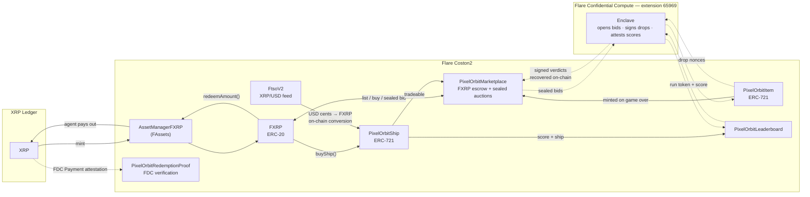
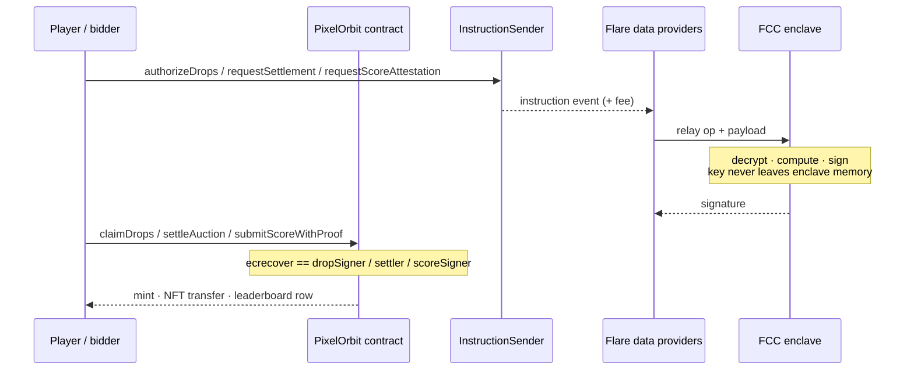

# 🚀 PixelOrbit

**▶ Live demo: https://pixelorbit.vercel.app/** — on Flare Coston2 testnet.

[](https://flare.network)
[](https://github.com/flare-foundation/tee-node)
[](https://dev.flare.network/fassets/overview)
[](https://dev.flare.network/ftso/overview)
[](contracts/test)

> **In one paragraph.** PixelOrbit is an arcade game whose entire economy runs on
> FXRP, and whose three trust-critical operations run inside a **Flare
> Confidential Compute** enclave: auction bids are sealed so only the TEE can read
> them and the winner pays the runner-up's price; the key that authorises item
> drops lives in the enclave rather than a server env var; and the leaderboard
> accepts a score only with an enclave signature. Every one of those is verified
> back on-chain by `ecrecover` in Solidity. Jump to
> [Where confidential compute comes in](#-where-confidential-compute-comes-in), or
> straight to the honest caveats in [Trust boundaries](#-trust-boundaries).

## The problem

FAssets make XRP usable on Flare — but there is almost nowhere to actually **spend** FXRP. You mint it, and then it sits there. An asset that can only be minted and redeemed is a bridge, not an economy. *(Bounty 1: FXRP utility and payment flows.)*

And the moment an economy is real, some of its logic stops being safe to run in public. A sealed-bid auction cannot publish its bids. A signing authority cannot sit in an environment variable. Transparent execution has no answer to either — that is where the TEE comes in. *(Bounty 2: confidential compute.)*

## What PixelOrbit is

**A demand-side sink for FXRP: a complete round trip from XRP on the XRP Ledger, into FXRP on Flare, through a real economy, and back out to XRP — with the parts that must stay private running in a TEE.**

FXRP is the *only* currency in PixelOrbit. Every ship purchase, every marketplace sale, every auction bid moves real FAssets-backed FXRP. Ship prices are denominated in **USD cents and converted on-chain** through the FTSOv2 XRP/USD feed, so what you pay tracks the live XRP price rather than a hardcoded number. When you want out, redemption sends real XRP back to your XRP Ledger address — and that payout is then proven on-chain through the Flare Data Connector, so it is evidence rather than the agent's own claim.

The arcade game is the reason anyone holds and circulates the asset. The product is the asset flow.



---

## 🔐 Where confidential compute comes in

Three mechanisms in this economy cannot be built with transparent execution
alone. Each runs inside a **Flare Confidential Compute** enclave (extension
`65969`), and the game never talks to it directly: a contract emits an
instruction, Flare's data providers relay it, the enclave answers, and the answer
comes back as an ECDSA signature that a contract recovers. **Confidential compute
is reached through Solidity, and its output is checked by Solidity.**

| | 🔨 Sealed-bid auctions | 📦 Drop authorisation | 🏆 Score attestation |
|---|---|---|---|
| **Enclave op** | `AUCTION` / `SETTLE` | `DROP` / `AUTHORIZE` | `SCORE` / `ATTEST` |
| **What runs privately** | decrypts every committed bid, drops the invalid ones, ranks the rest, picks the winner and the **second** price | signs one claim digest per crate nonce with a key that exists in no server environment | recovers the run token against `RUN_TOKEN_ISSUER`, bounds the score against elapsed time, signs the leaderboard digest |
| **The private input** | the bid amounts | the signing key | the signing key |
| **What comes back** | `(winner, clearingPrice, bidCount)` + signature | one 65-byte signature per nonce | one 65-byte signature |
| **Verified on-chain by** | `Marketplace.settleAuction` recovers against `settler` | `Item.claimDrops` recovers against `dropSigner` | `Leaderboard.submitScoreWithProof` recovers against `scoreSigner` |
| **Consumed on-chain as** | NFT transfer + FXRP settlement at the clearing price | ERC-721 mint, rarity rolled by `RandomNumberV2` | a leaderboard row |

All three recover to **one** address — `0x5e8BfFA9F796B7f612eF5d8e58e238EF6823e3bD`
— which is the enclave's sealed signing key and nothing else. It is not the
deployer, not the machine identity in the TEE registry, and not any key held by
the frontend or the server.



### Why confidential compute rather than a normal contract

The three cases have two different answers, and they are worth separating.

**Auctions — the data itself must stay secret.** On-chain verification requires
publishing the data being verified. A commit-reveal auction, the honest
transparent alternative, **publishes every bid** at reveal time; there is no way
around that, because the contract can only check a commitment against a plaintext
it has been shown. Here no losing bid is ever published and neither is the
winning bid — only the price the winner pays. Second-price pricing sharpens the
point further: a Vickrey auction needs an auctioneer who can *see* the bids to
compute the second price yet cannot exploit what they see. An enclave that
decrypts bids, returns only a signed `(winner, price)`, and holds no key anyone
can extract is exactly that auctioneer.

**Drops and scores — the authority must live somewhere, and the enclave is the
only place nobody can reach into.** Neither of these is confidential in the sense
of hiding data; a drop claim and a leaderboard row are both public. But both
require an off-chain authority — a game outcome cannot be replayed by the EVM,
and a signing key has to exist somewhere. Before this work that authority was a
plaintext private key in a server environment variable: one leak, and the whole
item supply and the entire leaderboard are forgeable, silently and
indistinguishably. Moving it into the enclave changes *who can forge* from
"anyone who reads one env var" to "nobody outside the TEE". That is a real
security property, and it is one confidential compute provides and transparent
execution structurally cannot.

Trust assumptions, including the ones that weaken these claims, are stated in
full in [Trust boundaries](#-trust-boundaries) — nothing below is hedged there.

---

**Built for Bounty 1 and Bounty 2.** One economy, two trust models: FXRP for the financial layer and a TEE for the parts that must stay private.

### 🌟 Key Features

**Confidential compute**

- **Sealed-bid Vickrey auctions** — bids are encrypted in the browser to the enclave's key, committed on-chain as opaque bytes, opened only inside the TEE. Losing bids are never published; the winner pays the runner-up's price
- **Confidential drop authorisation** — the key that signs item drops lives inside the enclave, not in a server environment variable
- **Enclave score attestation** — `submitScore` is permanently closed; a score reaches the leaderboard only with a signature the enclave produced

**Flare integration**

- **FDC-verified redemption payouts** — every FXRP redemption is followed automatically by a Flare Data Connector Payment attestation on the XRP Ledger transaction, re-verified on-chain by `PixelOrbitRedemptionProof`. The payout becomes evidence rather than the agent's own claim
- **FXRP round trip** — mint XRP → FXRP through the FAssets Asset Manager (via Xaman, because direct minting needs a raw-hex XRPL memo), spend it in-game, redeem back to real XRP
- **On-chain FTSOv2 pricing** — ship prices are stored as USD cents and converted to FXRP *inside Solidity* using the live XRP/USD feed, not a frontend display value
- **Verifiably random loot** — crates are sealed until claim time; the item and its rarity are rolled on-chain by Flare's `RandomNumberV2`, so neither the player nor the server chooses what drops
- **Registry-resolved, not hardcoded** — FXRP, FtsoV2, RandomNumberV2, FdcHub and Relay are all looked up through `FlareContractRegistry`, so the app follows the canonical deployments

**The game and its economy**

- **On-chain spaceships** — ERC-721 ships with nine distinct stats, purchasable with FXRP
- **Mintable game items** — claim your crates as ERC-721 items on game over, up to 12 per run
- **FXRP marketplace** — fixed-price listings and sealed auctions, NFT held in escrow, protocol fee capped at 5%
- **On-chain leaderboard** — global and per-ship, with settable usernames
- **In-game How To Play guide** — a mission-briefing modal (controls, energy, power-ups) reachable from the "Ready for Mission?" panel
- **Two-finger touch combat** — first finger steers and fires the volley; hold a second finger anywhere to fire the energy beam
- **Pilot profile & asset dashboard** — owned ships and items, FXRP/C2FLR balances, live bids, and portfolio value
- **Redemption timeline** — a live progress view of the burn → agent payout → FDC attestation → on-chain proof pipeline that survives closing the modal

### 🛠️ Tech Stack

| Layer | Technology |
|-------|-----------|
| **Blockchain** | Flare Network (Coston2 testnet) |
| **Currency** | FXRP (ERC-20 FAssets token) |
| **Flare infra** | FAssets Asset Manager, FTSOv2, FDC, RandomNumberV2, FlareContractRegistry |
| **Confidential compute** | Flare Confidential Compute — `tee-node` v0.0.21, extension `65969` |
| **Smart Contracts** | Solidity ^0.8.24 (compiled with 0.8.26, Cancun) + Hardhat — **212 tests** |
| **Enclave extension** | TypeScript on `node --test` — 34 tests ([separate repo](#-the-enclave-extension)) |
| **Frontend** | Next.js 16 + React 19 + TypeScript |
| **Wallet** | RainbowKit + wagmi v2 + viem; Xaman for the XRPL side |
| **UI** | TailwindCSS + Motion |
| **State** | Zustand + SWR |

---

## 📦 Smart Contracts

All contracts deployed on Coston2 testnet:

| Contract | Address | Description |
|----------|---------|-------------|
| PixelOrbitShip | [`0x95D2BC51d4Af8a9B4B3f4940077010B01e492B79`](https://coston2-explorer.flare.network/address/0x95D2BC51d4Af8a9B4B3f4940077010B01e492B79) | Ship NFT + buy with FXRP (USD-priced via FTSOv2) |
| PixelOrbitItem | [`0x3802FbF16987bC8F039a863711F3ce7f7E61342f`](https://coston2-explorer.flare.network/address/0x3802FbF16987bC8F039a863711F3ce7f7E61342f) | Item NFT + signer-gated drop claims, rarity from RandomNumberV2 |
| PixelOrbitMarketplace | [`0x30B3fDe31eE5FF930e7D66bbcc6C1F1292b39984`](https://coston2-explorer.flare.network/address/0x30B3fDe31eE5FF930e7D66bbcc6C1F1292b39984) | Fixed price + sealed-bid Vickrey auctions (one bid per address), FXRP escrow, capped protocol fee |
| PixelOrbitInstructionSender | [`0xc857272eB0Ab145d03Fd30f4763dB3C8A142c95A`](https://coston2-explorer.flare.network/address/0xc857272eB0Ab145d03Fd30f4763dB3C8A142c95A) | Relays drop authorisation, auction settlement and score attestation to the TEE (extension 65969) |
| PixelOrbitLeaderboard | [`0xcaa807D7c0C53A5A62db03622ade3b5CB653597d`](https://coston2-explorer.flare.network/address/0xcaa807D7c0C53A5A62db03622ade3b5CB653597d) | Attested score submission |
| PixelOrbitRedemptionProof | [`0x2673fee8164347aF23461A2382E12c26Fb99d9d1`](https://coston2-explorer.flare.network/address/0x2673fee8164347aF23461A2382E12c26Fb99d9d1) | FDC-verified proof that an FXRP redemption was paid out on the XRP Ledger |


### Flare infrastructure (resolved at runtime, not hardcoded in contracts)

| Contract | Address | Used for |
|----------|---------|----------|
| FXRP Token | [`0x0b6A3645c240605887a5532109323A3E12273dc7`](https://coston2-explorer.flare.network/address/0x0b6A3645c240605887a5532109323A3E12273dc7) | In-game currency (FAssets representation of XRP) |
| FlareContractRegistry | `0xaD67FE66660Fb8dFE9d6b1b4240d8650e30F6019` | Resolves everything below |
| AssetManagerFXRP | `0xc1Ca88b937d0b528842F95d5731ffB586f4fbDFA` | FXRP minting + redemption |
| FtsoV2 | `0xC4e9c78EA53db782E28f28Fdf80BaF59336B304d` | XRP/USD price feed (`0x015852502f55534400000000000000000000000000`) |
| RandomNumberV2 | resolved via registry | Item rarity at claim time — the roll is not the client's to make |
| FdcHub + FdcRequestFeeConfigurations | resolved via registry | Submitting the XRPL Payment attestation request |
| FdcVerification | resolved via registry | On-chain Merkle verification inside `PixelOrbitRedemptionProof` |
| Relay | resolved via registry | Block timestamp → FDC voting round id |
| FlareTeeManager diamond | `0x1a9C4A0f9D76c0b1D91d22E24E573a9b377618aE` | TEE extension + machine registry |

> Registry resolution is per-call for FDC and RandomNumberV2. Two exceptions are
> `immutable` and therefore baked into bytecode at construction:
> `PixelOrbitShip.ftsoV2` and `PixelOrbitMarketplace.fxrp`.

### Contract Architecture

```
PixelOrbitShip (ERC-721Enumerable)
├── getShipUsdPrice(shipTypeIndex) → the stored USD-cent price
├── getShipFxrpPrice(shipTypeIndex) → reads FTSOv2 XRP/USD, converts USD cents → FXRP
├── buyShip(shipTypeIndex) → FXRP transferFrom + mint
├── getShipStats(tokenId) → ShipStats{ hp, maxEnergy, energyRegen, laserWidth,
│                              laserDamage, bullet, width, height, maxFrame }
├── getShipType(index) / getShipTypeCount()
├── mintShip(to, shipTypeIndex) → owner-only, used to re-mint after a redeploy
├── setShipMetadataURI(shipTypeIndex, uri) → owner-only; a wrong JSON is a tx, not a redeploy
└── withdrawFXRP() → owner drains accumulated sale revenue

PixelOrbitItem (ERC-721Enumerable)
├── claimHash(to, nonce) → the exact digest the enclave signs, as a public view
├── claimDrop(nonce, signature) → returns tokenId; rarity from Flare secure random
├── claimDrops(nonces[], signatures[]) → batch claim on game over (max 12), returns tokenIds
├── setDropSigner(address) → owner rotates the authorising key
├── getTokenRarity(tokenId) → rarity rolled at claim time
└── getItemType(index) / getItemTypeCount()

PixelOrbitMarketplace (FXRP escrow, NFT custody on listing)
├── createListing(nftContract, tokenId, price, listingType, depositAmount, auctionDuration)
│                       → FixedPrice: price is the sale price. SealedAuction: price is the reserve.
├── buyItem(listingId) → FXRP transferFrom, fixed price only
├── commitBid(listingId, ciphertext) → stores an opaque bid + pulls the uniform bond
├── requestSettlement(listingId) → asks the enclave to open the bids (payable; anyone may call,
│                       but only after the deadline, unresolved, and with at least one bid)
├── settleAuction(listingId, winner, clearingPrice, bidCount, signature)
│                       → records the enclave's verdict; the signature is what authorises it
├── payWinningBid(listingId) → winner pays the clearing price, bond counts toward it
├── forfeitWinningBid(listingId) → after PAYMENT_WINDOW (24h), bond to seller and NFT back
├── withdrawDeposit(listingId) → losing bidders reclaim their bonds
├── reclaimUnsettled(listingId) → seller's exit when no bid arrived or no verdict ever came
├── cancelListing(listingId) / updatePrice(listingId, newPrice) → fixed price only
├── feeOn(price) / setFeeConfig(bips, recipient) → protocol cut, capped at MAX_FEE_BIPS = 5%
├── setSettler(address) / setInstructionSender(address) → owner-only enclave wiring
├── getListing(id) / getListingCount() / getActiveListings()
└── getSealedBids(listingId) / getBidders(listingId) → ciphertexts unreadable to everyone but the enclave

PixelOrbitInstructionSender (bridge to Flare Confidential Compute, extension 65969)
├── authorizeDrops(nonces[]) → OP DROP/AUTHORIZE, up to MAX_NONCES_PER_REQUEST = 12
├── requestAuctionSettlement(listingId, encryptedBids[], reservePrice)
│                       → OP AUCTION/SETTLE, up to MAX_BIDS_PER_SETTLEMENT = 32
├── requestScoreAttestation(score, shipName, runNonce, runLog) → OP SCORE/ATTEST
├── updateKey(encryptedKey) → OP DROP/UPDATE, owner-only: seals the signing key into the enclave
└── setExtensionIdExplicit(id) / extensionId() → one-shot bind, permanent

PixelOrbitLeaderboard
├── scoreHash(player, score, shipName, runNonce) → public view of the attested digest,
│                       so the off-chain and on-chain encodings can be compared without a tx
├── submitScoreWithProof(score, shipName, runNonce, attestation) → the only live path
├── submitScore(score, shipName) → reverts "Use submitScoreWithProof" while scoreSigner != 0
├── setScoreSigner(address) → owner; the zero address reopens the legacy path
├── usedRunNonces(nonce) → single-use; a rejected submission does not burn the nonce
├── setUsername(username) / getUsername(player)
├── getUserStats(user) → gamesPlayed, bestScore, spaceship
├── getShipBestScore(player, shipName) / getPlayerShipScores(player)
└── getAllUserStats() / getTotalPlayers()

PixelOrbitRedemptionProof (FDC receipt; holds no funds, gates nothing)
├── verifyPayout(requestId, proof) → FdcVerification.verifyPayment, then binds the proof
│                       to this redemption by deriving the payment reference itself
├── paymentReference(requestId) → (0x4642505266410002 << 192) | uint64(requestId)
├── isProven(requestId) / provenCount() / payouts(requestId)
└── event RedemptionPayoutVerified(requestId, transactionHash, prover,
                                   receivedAmount, paymentTimestamp, votingRound)
```

---

## 🔒 Feature 1 — Sealed-bid Vickrey auctions

Item auctions are **sealed-bid second-price (Vickrey)**. A bid is encrypted in the
browser to a key that exists only inside a Flare Confidential Compute enclave,
committed on-chain as opaque bytes, and opened by the enclave after the auction
closes. The winner pays the **runner-up's** bid, not their own.

### How one auction runs

1. **List.** The seller escrows the NFT and sets a reserve plus a bond amount.
2. **Commit.** Each bidder encrypts `(bidder, listingId, amount, salt)` to the
   enclave's public key and calls `commitBid`, posting the bond in FXRP. The
   contract stores the ciphertext without being able to read it. The bond is the
   **same for every bidder** — one that scaled with the bid would leak the bid.
   **One bid per address**, enforced on-chain: without that guard an address could
   commit a high bid to shape the Vickrey price and then a low one to win at it,
   and because the enclave sees only ciphertexts it cannot tell the two apart.
3. **Settle.** After the deadline, anyone calls `requestSettlement`. The enclave
   decrypts every ciphertext, discards bids below the reserve or bound to another
   listing or another bidder, collapses any repeat address to its best bid as a
   second line of defence, ranks the rest highest-first with earliest-commit as
   the tie-break, and signs `(listingId, winner, clearingPrice, bidCount)`.
4. **Verify.** `settleAuction` recovers that signature against the enclave's
   address. The digest covers the marketplace address and chain id, so a verdict
   cannot be replayed onto another deployment, and the contract independently
   checks that the winner actually bid and that the price clears the reserve.
5. **Pay.** The winner pays the clearing price; the bond counts toward it. Losers
   call `withdrawDeposit`. A winner who never pays is closed out after 24 hours by
   `forfeitWinningBid`, which sends their bond to the seller and the NFT back.

**The clearing price** is the second-highest surviving bid, or the reserve if
that is higher — and the reserve when only one bidder qualifies.

The settlement digest is a fixed 168-byte preimage over
`(marketplace, chainId, listingId, winner, clearingPrice, bidCount)`, wrapped in
the standard `\x19Ethereum Signed Message:\n32` prefix. The encryption is
go-ethereum's `ECIES_AES128_SHA256` — 65-byte uncompressed ephemeral pubkey ‖
16-byte IV ‖ AES-128-CTR ‖ 32-byte HMAC-SHA256, NIST SP 800-56 concat-KDF, shared
secret being only the X coordinate left-padded to 32 bytes. `eciesjs` cannot
produce that layout (it uses HKDF + AEAD), so it is hand-assembled in
[`src/lib/tee-encrypt.ts`](src/lib/tee-encrypt.ts).

### What is *not* hidden

Sealed means the amounts are sealed. Everything else about an auction is public
and visible to anyone reading the chain:

- **who bid** — `commitBid` is a transaction from the bidder's own address
- **how many bid** — the ciphertext array length, and `bidCount` in the settlement
- **the bond, the reserve, and the deadline** — all plain listing fields
- **the clearing price after settlement** — it has to be, the winner pays it

So an auction reveals the *shape* of the competition. It does not reveal any
amount that was not paid. One consequence follows directly from Vickrey and is
worth stating: with exactly two bidders, the clearing price **is** the loser's
bid.

### Verified on Coston2

Not just unit-tested. `contracts/scripts/live-auction-test.ts` drives a real
auction through the full path — three throwaway bidders at 0.05 / 0.04 / 0.02
FXRP against a 0.01 reserve — because the unit tests sign settlements with a local
key and so cannot catch the two things that only fail live: the enclave's digest
disagreeing with the contract's, and a ciphertext the browser's format produces
being unreadable inside the TEE. The second one fails *silently* — the enclave
skips bids it cannot decrypt, so a wrong ECIES layout surfaces only as
`no valid bids`.

Listing 1 on the live marketplace, run 2026-08-07 against tokenId 26. Winner
`0x7e145d54…`, the 0.05 bidder; clearing price **0.04 FXRP — the runner-up's
bid**; 3 of 3 ciphertexts decrypted inside the enclave.

| Step | Transaction |
|---|---|
| Settle (enclave verdict accepted on-chain) | [`0xd9afec28…`](https://coston2-explorer.flare.network/tx/0xd9afec282acfdc680c9078ef94565aac3192ad2023e44a7268af9f524a23248b) |
| Winner pays the clearing price, NFT transfers | [`0x273b6dcb…`](https://coston2-explorer.flare.network/tx/0x273b6dcb46cfaa28ac456ae00a9a62741ea54cfc2f3580e28cca6951859ac7c5) |
| Losing bidder reclaims their bond in full | [`0xaffabe74…`](https://coston2-explorer.flare.network/tx/0xaffabe7469435ccb18d4da4727408302602ac9fb00ad87fdc33bea3070abf762) |

The script asserts the Vickrey property rather than printing it: it fails if the
top bidder does not win, or if the clearing price is anything other than the
runner-up's bid. Nothing on-chain can check that — the marketplace only verifies
that the enclave signed the number it was given.

---

## 📦 Feature 2 — Confidential drop authorisation

Every crate picked up in a run needs an authorisation to become an NFT. That
authorisation is an ECDSA signature over
`keccak256(abi.encodePacked(itemContract, chainId, to, nonce))`, and
`PixelOrbitItem` mints only when it recovers `dropSigner`. The question is where
that key lives.

**It used to live in `ITEM_DROP_SIGNER_KEY`, a plaintext server env var.** Anyone
who could read it could mint the entire item supply. Now the key is sealed into
the enclave with `updateKey` — ECIES-encrypted client-side, sent **on-chain**,
relayed by Flare's data providers, and decrypted inside the TEE — and
`PixelOrbitItem.dropSigner` is an address only the enclave can sign for.

```
game over → authorizeDrops(nonces[])        one instruction, up to 12 nonces
          → enclave signs each claim digest  key never leaves enclave memory
          → claimDrops(nonces[], sigs[])     ERC-721 mint, rarity from RandomNumberV2
```

**The item contract was not changed at all.** It already verified
`digest.recover(signature) == dropSigner` against a replay-safe `claimedNonces`
mapping — this was a key swap, not a rewrite, which is exactly the property that
makes confidential compute adoptable in an existing system.

**What the enclave does not attest:** it signs *who may claim*, not *that the run
happened*. The rarity is not the enclave's to decide either — it is rolled
on-chain by Flare's `RandomNumberV2` at claim time.

Verified live on 2026-08-05: nonce `0x92929356…` → instruction
`0x6c4e308a…` → recovered `0x5e8BfFA9…` → **tokenId 23 minted**, itemType 7,
rarity 1. Re-runnable with
`npx hardhat run scripts/live-drop-check.ts --network coston2`.

---

## 🏆 Feature 3 — Score attestation in the enclave

The leaderboard's open `submitScore` is **permanently closed** — while
`scoreSigner != 0` it reverts `Use submitScoreWithProof`, so a score with no
attestation cannot be recorded at all. `submitScore(999999999, "cheat")` on the
live contract reverts today.

Two keys are involved and they are easy to conflate:

| Key | Address | What it signs | Where it lives |
|---|---|---|---|
| **Run-token issuer** | `0x1C6a9D84f44cD196e176F523e6225c84E85792f6` | the run token issued at `/api/game/start` — `(leaderboard, chainId, player, runNonce, issuedAt)` | a server env var, **by design** |
| **Score signer** | `0x5e8BfFA9F796B7f612eF5d8e58e238EF6823e3bD` | the leaderboard `scoreHash` the contract recovers | sealed inside the enclave |

On game over the client calls `requestScoreAttestation(score, shipName, runNonce,
runLog)`. Inside the enclave, `handleScoreAttest` recovers the run token against
`RUN_TOKEN_ISSUER` to learn when the run started, rejects a token that is expired
or whose `issuedAt` is in the future, takes the end of the interval from
`ctx.timestamp` (which rides in DataFixed under HashFixed and is therefore not the
caller's to choose), checks `score ≤ elapsedSeconds × MAX_SCORE_PER_SECOND` where
that constant is 200, and only then signs. `usedRunNonces` makes the attestation
single-use — and a *rejected* submission does not burn the nonce, so a failed
transaction cannot be used to grief a player out of their run.

### What this proves, and what it does not

**The enclave does not replay the run.** It checks that a token it can verify is
being redeemed once, for the wallet it was issued to, with a score that is not
impossible for the time elapsed. **A plausible-but-bounded fabricated run still
passes.**

Moving the signer into the enclave changed *who can forge an attestation* — the
key is no longer extractable from a server env var — but the enclave applies the
same bounds check, not a replay. The honest phrasing: **attestations are
unforgeable outside the TEE, and the score inside them is still only
bounds-checked.** Closing that gap means replaying the trace inside the enclave,
which needs a seeded PRNG in the game engine first (there are 14 unseeded
`Math.random()` calls across `GameEngine.ts` and `entities.ts` today). That is
scoped in `docs/SCORE-SIGNER-TEE-MIGRATION.md` and deliberately not claimed as
done.

Verified on-chain 2026-08-08: `scoreSigner()` reads back `0x5e8BfFA9…`, the
server's digest equals the contract's public `scoreHash` (`0x0ecef3c8…`), and
`simulateContract` on `submitScoreWithProof` with a real enclave signature is
accepted by the live contract. A green build does not prove the two digests
agree; that check does.

---

## 🛰️ Feature 4 — FDC-verified redemption payouts

When you redeem FXRP, an FAssets agent pays you in real XRP on the XRP Ledger.
Flare cannot see that happen on its own. Until an attestation says otherwise, the
payout is the agent's claim, not evidence.

So every redemption can be followed by a **Flare Data Connector**
Payment attestation on the XRPL transaction, whose Merkle proof is re-verified
on-chain by `PixelOrbitRedemptionProof`.

It is **opt-in, not automatic**: the redeem modal ships a "Prove payout via FDC"
toggle, on by default. The attestation costs a small C2FLR fee on `FdcHub`, and
some redemptions are not worth proving. Turning it off stops the flow at the
agent's payment — recorded as `settled` — and the tracker keeps a "Prove with
FDC" button on that card, so the decision is reversible at any time. The
upgrade pays the fee then, not sooner.

```
redeemFxrp(amount, xrplAddress)          src/services/redeem.ts
  → RedemptionRequested(requestId)        FXRP burned, agent payout queued
  → the modal can be closed; the watcher keeps running

watchRedemptionPayout(requestId, redeemer, withProof)   background, module-level state
  0. isProven(requestId)?                 already proven → skip, don't pay the fee twice
  1. poll explorer for RedemptionPerformed(redeemer, requestId)
                                          every 12s, 15 min window → XRPL tx hash
  withProof = false:                      stop here, phase = settled (upgradeable)
  2. POST /api/fdc/prepare                → verifier returns abiEncodedRequest
  3. FdcHub.requestAttestation            user signs, pays the configured fee
  4. Relay.getVotingRoundId(blockTimestamp)   round comes from the BLOCK, not the caller
  5. poll POST /api/fdc/proof             every 8s, 8 min timeout (a round takes ~90s)
  6. verifyPayout(requestId, proof)       → RedemptionPayoutVerified
```

Phases surface in the UI as a live timeline — `waiting-for-agent` → `agent-paid`
→ `attesting` → `verifying` → `verified`, with `settled` as the terminal state
when the proof was skipped — held in a module-level store read via
`useSyncExternalStore`, deliberately not component state: the round trip takes
minutes and closing the modal must lose nothing.

**The one thing that would have silently broken this.** `verifyPayout` takes
`requestId` *alongside* the proof and derives the expected payment reference
itself — `(0x4642505266410002 << 192) | uint64(requestId)` — then reverts if the
proof carries a different one. Without that binding, any valid XRPL Payment
attestation would prove any redemption, and the contract would be decorative.
Reading the reference from the Asset Manager instead is not possible:
`redemptionRequestInfo()` deletes the record on confirmation, which happens
*before* the attestation runs. The prefix was verified against four live Coston2
redemptions before the contract was committed, and the `RedemptionPerformed`
topic0 was checked against 1000 live events rather than trusted from a
calculation.

**Timeouts are recoverable.** If the DA layer lags past the 8-minute polling
window, the phase goes `failed` and the tracker card offers a **Retry proof**
button. The attestation the user already paid for stays valid on FDC, so the
retry resumes at the proof poll without paying the fee twice — it first reads
`isProven` (free; maybe someone else proved it), then reuses the cached voting
round and request bytes from the paid attestation. Only after a page reload,
when that in-memory cache is gone, does a retry re-run the whole pipeline,
fee included. A burn whose agent never pays (`waiting-for-agent` timed out)
has nothing to attest and gets no retry button.

---

## 🧩 The enclave extension

The TEE-side code is a **separate repository** ([pixelorbit-drop-extension](https://github.com/ikhsanRamadhan/pixelorbit-drop-extension), a
sibling checkout) because it is built into a Docker image whose hash is what gets
registered on-chain — not into this Next.js app. It is a
`tee-node` v0.0.21 extension registering four operations:

| OP | Command | Handler | Signs |
|---|---|---|---|
| `DROP` | `UPDATE` | `handleKeyUpdate` | nothing — decrypts the sealed signing key into memory |
| `DROP` | `AUTHORIZE` | `handleAuthorizeDrop` | one claim digest per nonce |
| `AUCTION` | `SETTLE` | `handleAuctionSettle` | `(listingId, winner, clearingPrice, bidCount)` |
| `SCORE` | `ATTEST` | `handleScoreAttest` | the leaderboard `scoreHash` |

The op strings must match the `bytes32` constants in
`PixelOrbitInstructionSender.sol` exactly, and the contract addresses and chain id
are baked into every digest the enclave produces — which is why they are enclave
config, not caller input. 34 tests (`node --test`) cover the digests, the ECIES
round trip, and the Vickrey ranking.

---

## 🚨 Trust boundaries

Stated plainly, because a confidential-compute claim is only worth what its
weakest assumption is worth. None of these are hypothetical: each one is a live
property of this deployment.

- **Attestation is simulated on this testnet deployment** (`MODE=1`, a whitelisted
  `codeHash`). The signature chain, the key isolation and the data-provider
  relay are real — an instruction genuinely goes on-chain, is relayed by Flare's
  providers, and comes back signed. The **hardware** attestation that would prove
  *which code* is running is not being enforced. Claiming Intel TDX here would be
  false.
- **The proxy could substitute the sealing key.** The enclave's public key is
  served by the proxy at `/info`; it is **not** published on-chain — the machine
  registry holds addresses and host URLs, not keys. A malicious proxy operator
  could serve their own key and read every bid sealed to it. The mitigation is
  pinning: the client pins the key in `NEXT_PUBLIC_TEE_PUBKEY_X/_Y` and refuses to
  encrypt on a mismatch. That converts a silent compromise into a visible failure
  — it makes a swap **detectable**, not impossible. Note the guard is fail-open
  when the pins are unset.
- **The sealed drop key is a copy.** It is the same key that was previously
  `ITEM_DROP_SIGNER_KEY`, so its plaintext has existed outside the enclave. The
  claim that holds is "the enclave signs drops and the key never has to leave it",
  **not** "the key exists only inside the enclave". A fresh keypair generated
  in-enclave would close this; rotating `dropSigner` is a single owner
  transaction.
- **Scores are bounds-checked, not replayed** — see
  [Feature 3](#-feature-3--score-attestation-in-the-enclave). Unforgeable outside
  the TEE.
- **The run-token issuer is a server key by design.** It anchors `issuedAt`, the
  start of the interval every score bound is measured against. Whoever holds it
  can backdate a run. It signs run tokens and never scores.
- **A TEE restart is destructive.** Restarting rotates the enclave keypair, which
  makes every already-committed ciphertext permanently undecryptable — the bids
  were sealed to a key that no longer exists anywhere. Those auctions cannot
  settle. `reclaimUnsettled` is the exit: 24 hours after the deadline the seller
  reclaims the NFT and every bidder withdraws their bond in full. Nothing is lost
  except the auction. The same restart orphans the on-chain machine registration,
  which is why the Railway service is never restarted casually.
- **There is no fallback auction path.** The open ascending auction was removed
  when this replaced it, deliberately — running both would have let a seller offer
  the transparent one and defeat the point. The consequence is that while the
  enclave is down, the marketplace offers fixed-price sales only.
- **The drop and score paths do have fallbacks, and both are weaker.**
  `DROP_FALLBACK_ENABLED` re-enables plaintext-key drop signing and is off by
  default. `NEXT_PUBLIC_SCORE_TEE_ENABLED` is a positive opt-in: with it unset the
  client posts to `/api/game/submit-score`, which signs with a plaintext server
  key. Neither is triggered by the enclave being unavailable — a TEE rejection
  propagates as an error rather than silently downgrading — but a **misconfigured
  deployment** can end up on the weaker path, and the resulting on-chain row looks
  identical.

---

## 🧭 Where this goes next

The confidential-compute surface here is deliberately general. `commitBid` stores
opaque bytes and `settleAuction` accepts a signed `(winner, price)` — neither
knows it is dealing with a game item. Three directions follow directly:

1. **Harden what exists.** Move to a Confidential Space host so the `MODE=1`
   caveat goes away, generate the drop keypair in-enclave so the "copy" caveat
   goes away, and seed the game PRNG so scores can be replayed rather than
   bounded. Each of these deletes a named line from
   [Trust boundaries](#-trust-boundaries) — the roadmap is that list, read
   upwards.
2. **Sealed markets past NFTs.** The same enclave op settles any sealed-bid
   market. FAssets collateral auctions, RWA lots, and any market where an
   auctioneer must see amounts but must not be trusted with them use the same
   commit → instruction → signed verdict shape, with a different digest.
3. **Confidential state as a primitive.** Private strategy execution, sealed
   orderbooks and TEE-scored ranking all reduce to "an off-chain authority whose
   key is unreachable, whose answer a contract verifies". This repository is a
   worked example of that pattern in a production-shaped app, not a toy: it is a
   key swap in an unchanged ERC-721, a settlement contract that never sees a bid,
   and a leaderboard that will not accept a score it cannot verify.

---

## 📋 Bounty Submission Mapping

This project is submitted for **both** Flare bounties. The mapping below shows where each requirement is satisfied in code and documentation.

### Bounty 1 — Interoperable Asset Products

| Requirement | Implementation |
|---|---|
| FXRP onboarding flows | `MintFxrpModal` + Xaman integration for XRPL deposits (see `src/app/api/xaman/`) |
| Cross-chain asset dashboard | `AssetDashboardModal` — ships, items, FXRP/C2FLR balances, live bids, portfolio value |
| Payment / merchant flows | Buy ship (FTSO-priced), fixed-price listings with FXRP escrow, marketplace fee collection |
| Asset movement UX | Redeem FXRP → XRP via FAssets; FDC-verified payout proof (see Feature 4) |
| Portfolio tools | PilotProfile with per-ship stats, high scores, net worth breakdown |
| Meaningful Flare infra use | FAssets mint/redeem, FTSOv2 live pricing, FDC attestation, RandomNumberV2, FlareContractRegistry |

### Bounty 2 — Confidential Compute Apps

| Requirement | Implementation |
|---|---|
| Sealed-bid / private auctions | Vickrey auction on `PixelOrbitMarketplace` — bids encrypted to enclave, settlement signed by TEE |
| TEE-secured agents / authority | Drop signing key and score attestation key live in enclave (Feature 2 & 3) |
| What runs privately in TEE | Bid decryption, Vickrey winner/price computation, drop authorisation, score validation |
| What is verified on-chain | `ecrecover` on signed verdicts; `PixelOrbitRedemptionProof` verifies XRPL payout |
| Trust assumptions | Full disclosure in [Trust boundaries](#-trust-boundaries) |
| Why CC vs normal contracts | See [Why confidential compute rather than a normal contract](#-why-confidential-compute-rather-than-a-normal-contract) |

### Timeline of New Work (evidence of build)

| Date | Milestone | Commit(s) |
|------|-----------|-----------|
| 2026-07-22 | Flare migration complete; chain configured; contracts deployed | `8bb482e`, `c7e6dc8`, `603a141` |
| 2026-07-23 | Ship + marketplace contracts stable; FXRP integration verified | `e45df60`, `4e007a1` |
| 2026-07-29 | Leaderboard overhaul; per-ship high scores; UX fixes | `87c1926`, `6d4a07f` |
| 2026-07-30 | FXRP → XRP redemption flow implemented | `8c0753b` |
| 2026-08-01 | Sealed auctions on marketplace; fixed-price + Vickrey dual mode | `f814110`, `15eed18` |
| 2026-08-03 | FCC (Flare Confidential Compute) architecture planned (`IMPROVE-BOUNTY2.md`) | `77c855e` |
| 2026-08-04 | Phase 0: TEE sender deployed; drop signing key moved to enclave | `d4d8736`, `c7debf2` |
| 2026-08-05 | Phase A: Live end-to-end drop authorisation via TEE verified | `0b1da0c`+ |
| 2026-08-05~09 | Phase B: Sealed auction settlement + unified sender + score attestation → all in TEE | `12313f8`, `04cc225`, ... |
| 2026-08-09 | Bounty submission: dual mapping, TEE health UI, documentation | *This commit onward* |

---

## 🚀 Getting Started

### Prerequisites

- Node.js 18+
- A wallet with C2FLR + FXRP from [Coston2 Faucet](https://faucet.flare.network/coston2)

### Installation

```bash
git clone https://github.com/your-repo/pixelorbit.git
cd pixelorbit
npm install
```

### Environment Setup

Copy `.env.example` to `.env.local` and fill in:

```env
NEXT_PUBLIC_NETWORK=coston2
NEXT_PUBLIC_WALLETCONNECT_PROJECT_ID=your_project_id

# Contracts
NEXT_PUBLIC_SHIP_CONTRACT_ADDRESS=0x95D2BC51d4Af8a9B4B3f4940077010B01e492B79
NEXT_PUBLIC_ITEM_CONTRACT_ADDRESS=0x3802FbF16987bC8F039a863711F3ce7f7E61342f
NEXT_PUBLIC_MARKETPLACE_CONTRACT_ADDRESS=0x30B3fDe31eE5FF930e7D66bbcc6C1F1292b39984
NEXT_PUBLIC_LEADERBOARD_CONTRACT_ADDRESS=0xcaa807D7c0C53A5A62db03622ade3b5CB653597d
NEXT_PUBLIC_PIXELORBIT_REDEMPTION_PROOF_ADDRESS=0x2673fee8164347aF23461A2382E12c26Fb99d9d1

# Confidential compute — the enclave path
NEXT_PUBLIC_DROP_SENDER_ADDRESS=0xc857272eB0Ab145d03Fd30f4763dB3C8A142c95A
NEXT_PUBLIC_EXT_PROXY_URL=https://<your-proxy-host>
NEXT_PUBLIC_SCORE_TEE_ENABLED=true
NEXT_PUBLIC_TEE_PUBKEY_X=0x0fc6c3db3d799269681cf88c25ffc028fb8c5b64f3189d80eef70b63cded5c1b
NEXT_PUBLIC_TEE_PUBKEY_Y=0x210c61725e1a9c95552ae1fd294c91d0fcb4c3c9f68d686369c5252a4996419e

# Availability fallbacks — leave unset. Both are strictly weaker trust models.
DROP_FALLBACK_ENABLED=
NEXT_PUBLIC_DROP_FALLBACK_ENABLED=

# Server-only (no NEXT_PUBLIC_ prefix — these must never reach the browser)
XAMAN_API_KEY=your_xaman_key
XAMAN_API_SECRET=your_xaman_secret
ITEM_DROP_SIGNER_KEY=
SCORE_SIGNER_KEY=0x...
```

`XAMAN_*` is required to mint FXRP: direct minting needs the payment reference in
the XRPL Memos field as raw hex, which browser wallets cannot express.

**`NEXT_PUBLIC_DROP_SENDER_ADDRESS`** is what switches the client onto the enclave
path for drops and auctions — its *presence* is the switch. **`NEXT_PUBLIC_EXT_PROXY_URL`**
is where the enclave's answers are collected from.

**`NEXT_PUBLIC_TEE_PUBKEY_X/_Y`** pin the enclave's ECIES public key. They must be
re-read from `${NEXT_PUBLIC_EXT_PROXY_URL}/info` after any TEE restart. Leaving
them empty **disables the check** and trusts whatever the proxy returns — the
guard fails open, so treat an empty pin as an unpinned deployment.

**`NEXT_PUBLIC_SCORE_TEE_ENABLED`** is a deliberate positive opt-in rather than an
inferred switch: with it unset, the client posts to `/api/game/submit-score`,
which signs with the plaintext `SCORE_SIGNER_KEY` — and if the live contract's
`scoreSigner` is the enclave key, every one of those submissions reverts
`Bad attestation`. Set it to `"true"` on any deployment where the score signer
lives in the TEE.

**`ITEM_DROP_SIGNER_KEY`** is now normally **empty**. It is only read when
`DROP_FALLBACK_ENABLED=true`; on the enclave path no plaintext drop key exists.

**`SCORE_SIGNER_KEY`** does *not* sign scores despite the name — it signs the
**run token** issued by `/api/game/start`, which the enclave verifies to learn
when a run began. It is a server key by design (see
[Trust boundaries](#-trust-boundaries)). The on-chain `scoreSigner` is the sealed
enclave key and is rotatable with `contracts/scripts/set-score-signer.ts`.

Contract-side deploy variables live separately in `contracts/.env.example`.

### Run Development Server

```bash
npm run dev
```

Open [http://localhost:3000](http://localhost:3000)

### Smart Contract Development

```bash
cd contracts
npm install

# Compile — Solidity 0.8.26, Cancun, optimizer 200 runs
npx hardhat compile

# Run tests (212 tests)
npx hardhat test

# Deploy to Coston2
npx hardhat run scripts/deploy.ts --network coston2

# Redeploy one contract only — the others keep their tokens and scores.
# deploy-ship.ts refuses to print its address if any ship type points at the
# wrong metadata JSON, which is what a redeploy is usually fixing.
npx hardhat run scripts/deploy-ship.ts --network coston2
npx hardhat run scripts/deploy-marketplace.ts --network coston2
npx hardhat run scripts/deploy-leaderboard.ts --network coston2
npx hardhat run scripts/deploy-redemption-proof.ts --network coston2

# Confidential compute wiring. The sender's _extensionId can only ever be set
# ONCE (require(_extensionId == 0)) — getting it wrong means a redeploy.
npx hardhat run scripts/deploy-instruction-sender.ts --network coston2
npx hardhat run scripts/bind-drop-extension.ts --network coston2
npx hardhat run scripts/set-score-signer.ts --network coston2

# Prove the enclave path end-to-end. Unit tests sign with a local key, so they
# cannot catch a digest disagreement or an unreadable ciphertext — these can.
npx hardhat run scripts/live-drop-check.ts --network coston2
npx hardhat run scripts/live-auction-test.ts --network coston2

# Around a ship redeploy: inventory the old address, drain its FXRP revenue
# (unreachable once the frontend moves), re-mint what players already own.
SHIP_ADDR=<old> npx hardhat run scripts/count-ships.ts --network coston2
SHIP_ADDR=<old> npx hardhat run scripts/withdraw-ship-fxrp.ts --network coston2
SHIP_ADDR=<new> npx hardhat run scripts/remint-ships.ts --network coston2
```

Test counts by suite: item drops 8, ship 25, marketplace fixed-price 23,
sealed-bid auction 37, leaderboard 25, redemption proof 20, instruction sender 17
— **212 total**. The enclave extension carries a further 34 under `node --test`
in its own repository.

---

## 🎯 How to Play

1. **Connect Wallet** — Click "Connect" to link your Flare wallet
2. **Get C2FLR** — [Coston2 Faucet](https://faucet.flare.network/coston2) for gas
3. **Mint FXRP** — Open the Mint modal, scan the Xaman QR, pay real testnet XRP on
   the XRP Ledger; FAssets mints the equivalent FXRP on Flare and the modal polls
   your balance until it lands
4. **Buy a Ship** — Visit the dealership; the FXRP price is derived live from
   FTSOv2's XRP/USD feed, so a fixed USD price stays fixed in USD
5. **Play** — Shoot aliens, survive waves, pick up sealed salvage crates
6. **Game Over** — Submit your score; the enclave attests it and the leaderboard
   verifies the signature on-chain. Then claim your crates: one instruction
   authorises up to 12, and each one's rarity is rolled by Flare's secure random
   at claim time, not by the client
7. **Marketplace** — List items at a fixed price, or run a **sealed-bid auction**
   where bids are encrypted to the enclave and the winner pays the runner-up's
   price. Track your own bids and deposits from the same panel
8. **Leaderboard** — Global and per-ship rankings; your pilot profile shows your
   best run, your ships and your item inventory
9. **Redeem** — Burn FXRP back to real XRP. The payout is then attested through
   FDC and the Merkle proof verified on-chain, so the timeline ends at
   `verified`, not at "the agent says it paid"

---

## 🏗️ Project Structure

```
pixelorbit/
├── contracts/                    # Hardhat workspace — 212 tests
│   ├── contracts/
│   │   ├── PixelOrbitShip.sol            # ERC-721 ships, FTSOv2 pricing
│   │   ├── PixelOrbitItem.sol            # ERC-721 items, signature-gated drops
│   │   ├── PixelOrbitMarketplace.sol     # Fixed price + sealed-bid Vickrey
│   │   ├── PixelOrbitLeaderboard.sol     # Attested scores, global + per-ship
│   │   ├── PixelOrbitInstructionSender.sol  # → FCC: DROP / AUCTION / SCORE
│   │   ├── PixelOrbitRedemptionProof.sol # FDC Payment proof verification
│   │   ├── interfaces/                   # IFdcVerification, IPayment, …
│   │   └── mocks/                        # Local FXRP, registry, FTSO doubles
│   ├── test/                     # 7 suites (see Smart Contract Development)
│   ├── scripts/                  # Deploy, wire, and LIVE verification scripts
│   └── typechain-types/          # Generated — regenerate, never hand-edit
├── src/
│   ├── app/
│   │   ├── page.tsx · layout.tsx · providers.tsx · actions.ts
│   │   └── api/
│   │       ├── fdc/prepare · fdc/proof        # FDC verifier + DA layer
│   │       ├── game/start · game/submit-score # run token; fallback signer
│   │       ├── items/authorize-drop           # fallback drop signer
│   │       ├── tee/info · tee/result          # enclave pubkey + answers
│   │       └── xaman/…                        # XRPL payload lifecycle
│   ├── components/
│   │   ├── layout/               # ClientProviders, Gameover, backgrounds
│   │   ├── ui/                   # 18 components — marketplace, mint, redeem,
│   │   │                         #   profile, leaderboard, redemption tracker
│   │   └── utils/                # Ship, item and enemy data + sorting
│   ├── game/                     # Canvas engine: loop, physics, spatial grid,
│   │                             #   renderer, HUD bridge, audio, perf monitor
│   ├── hooks/                    # useMarketplace, useLeaderboard, usePilotProfile,
│   │                             #   useRedemptionStatus, useNow, useModalA11y
│   ├── services/                 # Chain I/O — 17 modules:
│   │   ├── tee-instructions.ts   #   send an instruction, await the enclave
│   │   ├── confidential-drops.ts #   enclave drop authorisation + claim
│   │   ├── score-attestation.ts  #   enclave score attestation
│   │   ├── fdc.ts · redeem.ts    #   redemption + FDC proof pipeline
│   │   ├── marketplace.ts · user-bids.ts · portfolio.ts
│   │   └── mint.ts · xaman.ts · ships.ts · items.ts · leaderboard.ts · …
│   ├── stores/                   # Zustand: game-store, wallet-store
│   └── lib/
│       ├── tee-encrypt.ts        # Hand-built go-ethereum ECIES (see Feature 1)
│       ├── auction.ts            # Sealed-bid payload encoding
│       ├── contracts.ts · abis/  # Addresses + exported ABI JSON
│       ├── xrpl.ts · chains.ts · wagmi.ts · refresh.ts · ui-tokens.ts
│       └── __tests__/            # ECIES round-trip and encoding tests
├── .env.example                  # App env template — copy to .env.local
├── contracts/.env.example        # Deploy env template — copy to contracts/.env
└── README.md                     # This file
```

The enclave extension is **not** in this tree — it is a separate repository, built
into a Docker image whose hash is what gets registered on-chain. See
[The enclave extension](#-the-enclave-extension).

---

## 🔗 Links

**This project**

- **Live demo**: [https://pixelorbit.vercel.app/](https://pixelorbit.vercel.app/)
- **The three enclave-signed contracts**, all recovering the same sealed key —
  [Item](https://coston2-explorer.flare.network/address/0x3802FbF16987bC8F039a863711F3ce7f7E61342f) ·
  [Marketplace](https://coston2-explorer.flare.network/address/0x30B3fDe31eE5FF930e7D66bbcc6C1F1292b39984) ·
  [Leaderboard](https://coston2-explorer.flare.network/address/0xcaa807D7c0C53A5A62db03622ade3b5CB653597d)
- **The instruction sender** (bound to extension `65969`):
  [`0xc857272e…`](https://coston2-explorer.flare.network/address/0xc857272eB0Ab145d03Fd30f4763dB3C8A142c95A)

**Flare**

- **Flare Network**: [https://flare.network](https://flare.network)
- **Confidential Compute node** (`tee-node`, the runtime this extension targets):
  [https://github.com/flare-foundation/tee-node](https://github.com/flare-foundation/tee-node)
- **Coston2 Explorer**: [https://coston2-explorer.flare.network](https://coston2-explorer.flare.network)
- **Coston2 Faucet**: [https://faucet.flare.network/coston2](https://faucet.flare.network/coston2)
- **FAssets Docs**: [https://dev.flare.network/fassets/overview](https://dev.flare.network/fassets/overview)
- **FDC Docs**: [https://dev.flare.network/fdc/overview](https://dev.flare.network/fdc/overview)

---

## 📄 License

MIT
