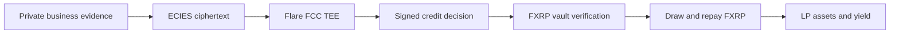
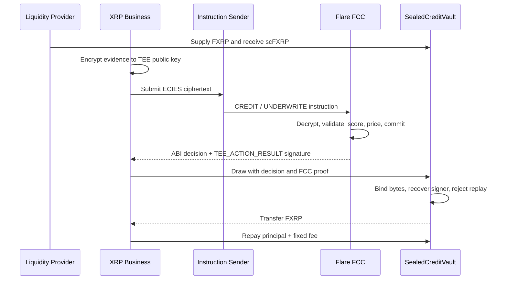

<div align="center">
  
  <h1>Sealed Credit</h1>
  <p><strong>Confidential FXRP working-capital lines for XRP-native businesses</strong></p>
  <p>Private evidence · Attested underwriting · Verifiable credit · Programmable FXRP liquidity</p>
  <p>
    <strong>English</strong>
    ·
    <a href="README.zh-TW.md">繁體中文</a>
  </p>
  <p>
    <a href="https://github.com/stephenovo/sealed-credit"><strong>GitHub</strong></a>
    ·
    <a href="https://sealed-credit.pages.dev"><strong>Live app</strong></a>
    ·
    <a href="docs/ARCHITECTURE.md">Architecture</a>
    ·
    <a href="docs/SECURITY.md">Security</a>
    ·
    <a href="docs/DEPLOYMENT.md">Deployment</a>
    ·
    <a href="docs/SUBMISSION.md">DoraHacks submission</a>
  </p>
  <p>
    
    
    
    
    
    
  </p>
</div>

<p align="center">
  
</p>

> **Flare Summer Signal** · Bounty 1: Interoperable Asset Products · Bounty 2: Confidential Compute Apps

## Overview

Sealed Credit lets an XRP merchant, payroll operator, market maker, or treasury prove creditworthiness without publishing revenue, balances, invoices, or existing obligations. Sensitive evidence is ECIES-encrypted to a Flare Confidential Compute (FCC) machine, assessed inside its TEE, and returned as a signed, privacy-minimized credit decision. An onchain FXRP vault verifies the native FCC result signature before releasing working capital.

| User | Need | Sealed Credit outcome |
| --- | --- | --- |
| **XRP business** | Short-duration liquidity without exposing its books | Private underwriting and an enforceable FXRP facility |
| **Liquidity provider** | Transparent yield with inspectable risk rules | Tokenized `scFXRP` shares and conservative vault accounting |
| **Protocol integrator** | A machine-verifiable private decision | ABI result, evidence commitment, model hash, and native TEE proof |

> **The product in one sentence:** private business evidence becomes a credit decision that an FXRP smart contract can verify and execute.

## Product loop



The privacy boundary is functional, not decorative. Raw evidence stays inside FCC. The chain receives only bounded decision data: borrower, score, risk tier, credit limit, fee, term, expiry, evidence commitment, model hash, replay-protected identifiers, and the TEE result signature.

## Why Flare is essential

| Flare primitive | Required role |
| --- | --- |
| **FXRP / FAssets** | The supplied, borrowed, and repaid working-capital asset. It preserves the user's XRP-native treasury and settlement path. |
| **Flare Confidential Compute** | Decrypts commercially sensitive evidence and runs the deterministic underwriting policy inside a TEE. |
| **FCE instruction registry** | Routes `CREDIT / UNDERWRITE` from the dedicated Solidity sender to a registered extension machine. |
| **TEE identity signatures** | Lets the vault verify the exact `TEE_ACTION_RESULT` domain, chain ID, action hash, result bytes, instruction ID, status, and submission tag used by `tee-node` v0.0.24. |
| **Coston2** | Target network for the registered extension, instruction sender, FXRP vault, and public test transactions. |

Removing either FXRP or FCC breaks the central user promise. This is not a generic lending interface with a Flare badge.

## What is implemented

| Area | Capabilities |
| --- | --- |
| **Product workspace** | Responsive overview, editable private assessment, computed approval and decline paths, liquidity vault, event ledger, wallet connection, Demo mode, and a verified-data-only Coston2 control room |
| **Live chain client** | Official Coston2 FXRP balance reads plus prepared MetaMask approval, deposit, withdrawal, receipt tracking, and session activity once a verified vault address is configured |
| **Confidential model** | Strict schema and amount validation, score bands, capacity limits, term-aware fees, evidence commitments, bounded outputs, and pinned model hash |
| **FCC extension** | TypeScript FCE extension, node-local `/decrypt`, ABI result encoding, Docker image, proxy configuration, registration tools, and encrypted Coston2 runner |
| **FXRP vault** | `scFXRP` shares, underlying decimal alignment, proportional deposits and withdrawals, credit draws, partial/full repayment, delinquent write-off, and conservative asset accounting |
| **Proof verification** | Native FCC action-result signature recovery, exact decision-byte binding, chain-domain separation, approved-model enforcement, two-hour permit validity, and signer checks |
| **Replay protection** | Unique FCC instruction ID, unique private assessment nonce, one active loan per borrower, and checks-effects-interactions ordering |
| **Verification** | 5 Solidity integration tests, 26 FCC/model tests, 10 web/configuration tests, production compilation, Go tool tests, shell syntax checks, Docker image build, and desktop/mobile visual QA |

## Current release status

| Surface | Status |
| --- | --- |
| Local product demo | **Ready** — decisions are computed from editable inputs; exports are explicitly marked local-only |
| Contracts and FCC extension | **Implemented and tested** |
| GitHub repository | **Public** — [stephenovo/sealed-credit](https://github.com/stephenovo/sealed-credit) |
| Public web app | **Live** — [sealed-credit.pages.dev](https://sealed-credit.pages.dev) |
| Coston2 deployment | **Pending verified addresses and funded deployment credentials** |
| Demo video | **Pending recording** |
| Production funds | **Not supported** — contracts are unaudited hackathon software |

The UI never presents a local simulation as a live TEE result. Coston2 actions remain blocked until verified public deployment details are wired into the release build.

## Architecture



The Solidity verifier recreates the same hash hierarchy as `tee-node`:

```text
actionHash  = keccak256(keccak256(data) || instructionId || keccak256(tag) || status)
payloadHash = keccak256(abi.encode("TEE_ACTION_RESULT", chainId, actionHash))
signer      = ecrecover(toEthSignedMessageHash(payloadHash), signature)
```

See [Architecture](./docs/ARCHITECTURE.md) for component boundaries, decision ABI, vault accounting, and trust assumptions.

## Quick start

Requirements: Node.js 20 or newer. Docker, Foundry, Go, `jq`, and a public HTTPS tunnel are additionally required for a full FCC deployment.

```bash
git clone https://github.com/stephenovo/sealed-credit.git
cd sealed-credit
npm install
npm --prefix fcc/typescript install
npm run check
npm run dev
```

Open `http://localhost:4173`. Demo mode needs no wallet and supports editable approvals, declines, one-time draws, proof export, vault actions, and activity filters.

Focused commands:

```bash
npm run contracts:test   # Solidity proof and vault integration
npm run fcc:test         # Confidential model and FCE server
npm run build            # Contract compilation and production web build
```

## Repository map

```text
apps/web/                  React + Vite product workspace
packages/contracts/        FXRP vault, mock FXRP, compiler, deployer, tests
fcc/                       Flare FCE scaffold and Sealed Credit extension
  contracts/               CREDIT / UNDERWRITE instruction sender
  typescript/src/app/      Confidential model and ABI result encoding
  tools/cmd/run-test/      Encrypted Coston2 request and TEE proof verifier
docs/                      Architecture, security, deployment, demo, submission
```

## Privacy and trust boundary

| Stays private | Becomes public |
| --- | --- |
| Revenue, balances, obligations, invoices, operating history, XRPL-derived evidence, evidence salt | Borrower address, approved principal, fee, term, tier, score, bounded ratios, expiry, commitment, model hash, FCC proof, FXRP transfers |

Sealed Credit does **not** claim that FXRP settlement is private or that a TEE removes credit risk. Read the full [security model](./docs/SECURITY.md) before working with the contracts.

## Deploy to Coston2

The reproducible order is:

1. Deploy and register `SealedCreditInstructionSender` and the FCC extension.
2. Start the extension TEE and proxy, then verify `/info` and its registered identity.
3. Run the encrypted Go test and recover the native result signer.
4. Deploy `SealedCreditVault` with Coston2 FXRP, the TEE identity, and the approved model hash.
5. Publish verified addresses and transaction hashes, then wire the web release.

Follow [Deployment](./docs/DEPLOYMENT.md). Never commit deployment keys, proxy database credentials, or borrower evidence.

## Verification

```bash
npm run check
```

Expected result: **41 automated tests pass**, Solidity and TypeScript compile, and the production web bundle is generated. The Go deployment tools have also been generated, compiled, and tested against the pinned FCC dependencies. The pinned FCC Docker image builds locally as `sealed-credit-fcc:1.0.0`.

## Roadmap

- [x] Confidential underwriting model and ABI decision format
- [x] Native FCC `TEE_ACTION_RESULT` verification in Solidity
- [x] Tokenized FXRP vault and loan lifecycle
- [x] Responsive borrower and liquidity-provider workspace
- [x] Encrypted Coston2 runner and reproducible FCC deployment stack
- [x] Public Cloudflare Pages app and live Coston2 FXRP wallet reads
- [ ] Publish Coston2 extension, TEE, sender, vault, and FXRP addresses
- [ ] Record the three-minute demo
- [ ] Add FDC-verified XRPL revenue and invoice-source attestations
- [ ] Add multi-TEE quorum, exposure caps, tranches, reserve governance, and timelocks
- [ ] Complete contract audit, model validation, legal review, and mainnet readiness

## Documentation

- [System architecture](./docs/ARCHITECTURE.md)
- [Security and trust model](./docs/SECURITY.md)
- [Coston2 deployment runbook](./docs/DEPLOYMENT.md)
- [Three-minute demo script](./docs/DEMO_SCRIPT.md)
- [DoraHacks submission draft](./docs/SUBMISSION.md)
- [Hackathon strategy and judging analysis](./docs/HACKATHON_STRATEGY.md)

## New work for Summer Signal

The product model, FCC extension, credit-decision ABI, native TEE-proof verifier, FXRP vault, web experience, tests, deployment tooling, and submission materials were created for Flare Summer Signal. The only upstream base is Flare Foundation's official FCE scaffold under `fcc/`, retained for reproducible deployment.

## License

MIT. The included Flare FCE scaffold remains subject to its upstream notices and commit history.

---

<div align="center">
  <strong>Private evidence in. Verifiable FXRP credit out.</strong>
</div>
