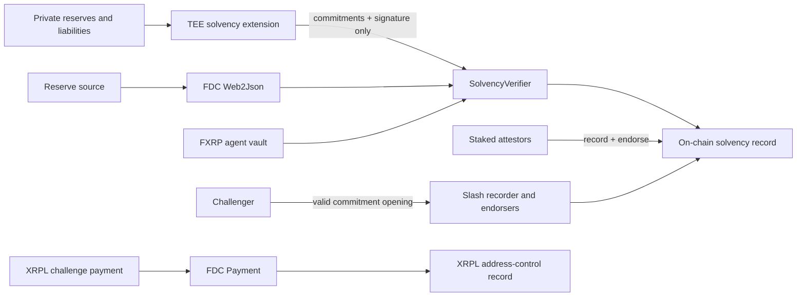

# Vouchsafe

**Private, stake-backed proof of solvency for RWA issuers and FXRP agents on Flare.**

[](https://github.com/tang-vu/Vouchsafe/actions/workflows/ci.yml)
[](https://tang-vu.github.io/Vouchsafe/)
[](https://coston2-explorer.flare.network/)

Vouchsafe lets an issuer prove `reserves >= liabilities` without publishing its balance sheet. The private check
runs in confidential compute; Flare Data Connector (FDC) anchors reserve evidence; independent attestors stake
collateral; and a valid fraud opening slashes the recorder and every endorser.

Built for both **Flare Summer Signal** bounties:

- **Interoperable Asset Products:** FDC Web2Json + FDC Payment on XRPL + FXRP agent binding.
- **Confidential Compute Apps:** a real GCP Confidential Space run plus a native Flare Confidential Compute
  extension adapter registered on Coston2.

## Judge it in 60 seconds

1. Open the **[live evidence dashboard](https://tang-vu.github.io/Vouchsafe/)**. It is a static, read-only judge
   build with a deterministic snapshot of live Coston2 records; each claim links to primary evidence.
2. Open the [real-enclave settlement transaction](https://coston2-explorer.flare.network/tx/0x8f0595ba1a94b29988df6e9bb139a5cbe8c94f4c580dbc23fefe3ed641202d47).
   Its recovered signer is the key generated inside a GCP Confidential Space AMD SEV workload.
3. Inspect the [source-verified native FCC adapter](https://coston2-explorer.flare.network/address/0x146D6CC320c567f37673303eb5a7a4638D7Dacb9#code),
   registered with FlareTeeManager as public extension **66194**.
4. Inspect a [permissionless fraud proof and slash](https://coston2-explorer.flare.network/tx/0xcfa391b0077b180ebc29b5406f55d044ba7e639c8f009b79e0a1991b803f2347).
5. Watch the [3:02 narrated demo](https://youtu.be/1t-Nm9hdITs), then use [JUDGES.md](JUDGES.md) for the exact
   evidence map and honest scope boundary.

## Why this is more than a dashboard



The core record cannot be created with only a TEE signature or only an FDC proof. `recordSolvency` binds both
proof systems to the same committed reserves, checks the registered TEE signer, checks stake and issuer policy,
and stores a commitment-only result. Quorum and slashing make the claim economically accountable after issuance.

## What is live

| Capability | Status | Evidence |
|---|---|---|
| Confidential solvency settlement | Live on Coston2 | [real GCP TEE transaction](https://coston2-explorer.flare.network/tx/0x8f0595ba1a94b29988df6e9bb139a5cbe8c94f4c580dbc23fefe3ed641202d47) |
| FDC Web2Json reserve proof | Live on Coston2 | [record transaction](https://coston2-explorer.flare.network/tx/0xb453bf855e2fdeff63f1c9701e1246b52a710aca11b76d09efd6799bc099df2a) |
| FDC Payment / XRPL control | Live on Coston2 + XRPL testnet | [fresh Coston2 proof](https://coston2-explorer.flare.network/tx/0x606ad2f1b31863f58d838388029a974e0b369a00d257fb805f14277ee0b8e55b) / [XRPL payment](https://testnet.xrpl.org/transactions/C989160622852AD82FEFA51B0046CB82EC8524D25A1B3207B66E8A206D3FD0DA) |
| Multi-attestor quorum | Live on Coston2 | [quorum transition](https://coston2-explorer.flare.network/tx/0x4d632ff3803de7b51d8bdfa784c397c86c71f90cd7fc931b94c09578e4a7dd03) |
| Commitment-opening fraud proof | Live on Coston2 | [slash transaction](https://coston2-explorer.flare.network/tx/0xcfa391b0077b180ebc29b5406f55d044ba7e639c8f009b79e0a1991b803f2347) |
| Native FCC action wire + instruction sender | Adapter ready on Coston2 | [extension 66194 contract](https://coston2-explorer.flare.network/address/0x146D6CC320c567f37673303eb5a7a4638D7Dacb9#code) |
| Full FCC proxy + promoted machine round-trip | Not claimed | Needs an active billed confidential VM and Flare indexer access |

## Native Flare Confidential Compute integration

This repository now implements the current Flare FCC scaffold boundary rather than a project-specific imitation:

- `VouchsafeFccInstructionSender` discovers its public extension ID from FlareTeeManager, selects a registered
  machine and routes ciphertext through `sendInstructions`.
- The extension implements FCC `/state` and `/action` envelopes, accepts `bytes32("SOLVENCY")` /
  `bytes32("PROVE")`, and can decrypt through the local tee-node `SIGN_PORT` boundary.
- The response contains only commitment fields and the TEE signature; plaintext figures are never returned.
- On Coston2 the sender is registered, both project/machine owners are allowlisted, EVM is enabled as a key type,
  and extension ID **66194** is bound in the verified contract.

See [docs/fcc-integration.md](docs/fcc-integration.md) for transaction-level evidence and the precise production
promotion steps that remain.

## Contracts on Coston2 (chain ID 114)

| Contract | Address |
|---|---|
| SolvencyRegistry | [`0x7dE3581C791F040B2df07520B4334C93DeF5C3E8`](https://coston2-explorer.flare.network/address/0x7dE3581C791F040B2df07520B4334C93DeF5C3E8#code) |
| AttestorStaking | [`0x24d5f0B559E84d50f651b7e45577Baf638978e1E`](https://coston2-explorer.flare.network/address/0x24d5f0B559E84d50f651b7e45577Baf638978e1E#code) |
| SolvencyVerifier | [`0x59b044B0a2d17FE10336367B1d9f25C6DcB76686`](https://coston2-explorer.flare.network/address/0x59b044B0a2d17FE10336367B1d9f25C6DcB76686#code) |
| FxrpAgentBinding | [`0xc98F898f4717879237FB5eB5d82afe7BFD874ccc`](https://coston2-explorer.flare.network/address/0xc98F898f4717879237FB5eB5d82afe7BFD874ccc#code) |
| XrplReserveProof | [`0x878Fe3305cC23aDfa6CfF10E1B9e811e9A2Ac9f0`](https://coston2-explorer.flare.network/address/0x878Fe3305cC23aDfa6CfF10E1B9e811e9A2Ac9f0#code) |
| VouchsafeInstructionSender (legacy direct path) | [`0x38e53EF3eF09BE3cF0C10Fdbb36c702747F32FfE`](https://coston2-explorer.flare.network/address/0x38e53EF3eF09BE3cF0C10Fdbb36c702747F32FfE#code) |
| VouchsafeFccInstructionSender (native adapter) | [`0x146D6CC320c567f37673303eb5a7a4638D7Dacb9`](https://coston2-explorer.flare.network/address/0x146D6CC320c567f37673303eb5a7a4638D7Dacb9#code) |

All seven contracts are source-verified. Deployment addresses and FCC registration transactions are machine-
readable in [`contracts/deployments/coston2.json`](contracts/deployments/coston2.json).

## Reproduce locally

Requirements: Node.js 20 and Yarn Classic.

```bash
corepack enable
corepack prepare yarn@1.22.22 --activate
yarn install --frozen-lockfile
yarn verify
```

Useful live flows:

```bash
yarn service      # http://localhost:7900; API + wallet-enabled five-act UI
yarn demo         # TEE + FDC Web2Json + quorum + slash, live Coston2 flow
yarn demo:xrpl    # XRPL testnet payment -> FDC Payment -> Coston2 control proof
```

The test gate compiles every workspace, runs **65 contract tests**, and runs 14 TEE/FCC-wire privacy assertions.
CI also audits the dependency tree.

## Repository map

```text
contracts/         Solidity 0.8.25 / EVM Cancun, deployment scripts and tests
tee-extension/     Confidential compute, native FCC wire adapter, GCP Confidential Space image
attestor-service/  Orchestrator, FDC clients, event indexer, API and frontend
docs/              Architecture, FCC evidence, deployment and security notes
```

## Honest security boundary

- A recorded claim reveals commitments, a boolean, timestamps and identities—not the private balance sheet.
- A fraud challenge deliberately reveals the committed `(reserves, liabilities, salt)` to prove a lie. This suits
  the auditor/counterparty model; a ZK inequality proof is the next privacy upgrade.
- The real Confidential Space execution and settlement are evidenced. The native FCC adapter is registered and
  tested, but this submission does **not** claim a live promoted FCC machine round-trip.
- FDC data freshness is enforced for the XRPL path. The older Web2Json verifier does not yet impose a maximum age;
  production ownership should also move to a multisig/timelock.

The full new-vs-integrated breakdown and paste-ready hackathon entry are in [SUBMISSION.md](SUBMISSION.md).
Security assumptions are in [SECURITY.md](SECURITY.md). The project is released under the [MIT License](LICENSE).
